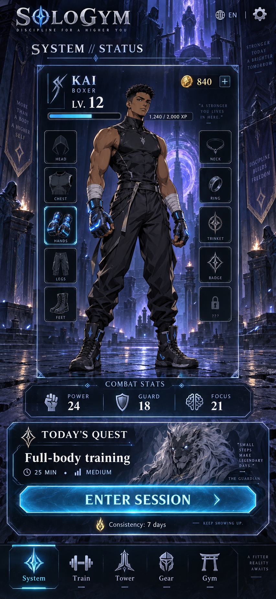
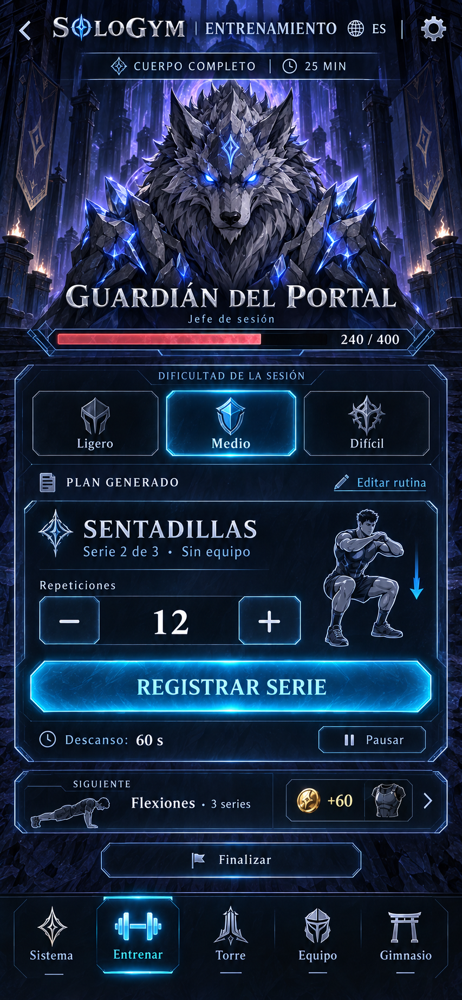
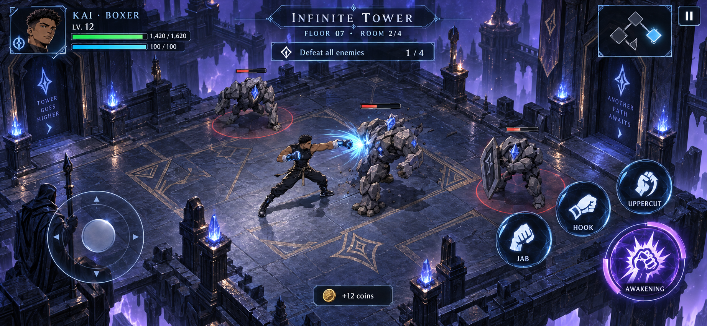

**SoloGym — first style review**

**Current window:** [WIN-001 System / Home v2, with embedded English and Spanish renders](../docs/windows/WIN-001-system-home-g0.md), is the approved visual target. The [native Home implementation and final comparisons](../docs/windows/WIN-001-implementation.md) are ready for visual review; they are not recorded as a strict 1:1 pass. The [manifest](reference-manifests/WIN-001-system-home-v2.json) preserves exact files, prompts, dimensions and hashes. The original three images below remain style references.

The user approved the overall style on 2026-09-25. These static concepts were generated with the built-in image generation tool using the imagegen skill. For Home, the latest instruction supersedes individual asset stops with complete-window construction followed by focused full-screen comparison. Other windows and the modular character/gear pipeline retain their separate milestones. The training data shape and window plan are accepted for continued design.

Automation means generating an editable workout plan for each boss. Users log completed sets, repetitions, and load manually. There is no camera or automatic repetition detection in this scope.

The proposed style combines indigo temple environments, cyan/violet System windows, silver type, manhua characters, angular controls, and illustrated gear. Portrait menus/workout screens and landscape combat are shown as orientation proposals. Demo numbers, character names, enemy names, combat abilities, and copy are illustrative. Generated marginal slogans are not fixed product copy; the later page-by-page render pass will refine wording, HUD details, bilingual equivalents, and exact touch layouts.

**System/status — English.** Character presentation, gear framing, progress, daily quest, and navigation.

[Exact generation prompt](prompts/01-system-status-v1.txt)

**Workout boss — Spanish.** Generated routine, difficulty choice, manual repetition entry, set registration, and rest controls.

[Exact generation prompt](prompts/02-workout-boss-es-v1.txt)

**Tower combat — English.** Isometric room, free movement joystick, three attacks, and a special ability.

[Exact generation prompt](prompts/03-tower-combat-en-v1.txt)

[Research with sources](../docs/research/2026-09-25-fitness-game-research.md) · [High-level concept and full render coverage inventory](visual-approval-plan.md)
