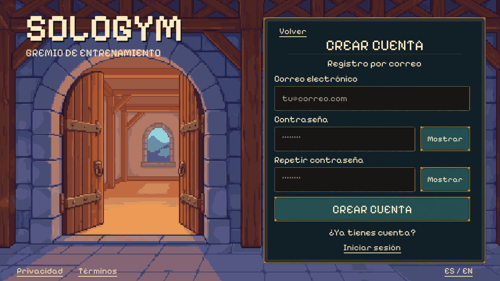

# Account creation — landscape window

The user approved the render with **“good, do it”** after login PR #32 merged
(`434c162`). The native form is implemented. Production account creation remains
blocked by the missing connected eligibility/consent service; no real account was
created during this work.



[Approved concept](account-concept.png) · [Exact imagegen prompt](screen-prompt.txt) ·
[Source hashes](manifest.json) · [Verification](verification.json)

The implementation reuses the original PixelLab guild entrance, panel, fields and
buttons. Background art, live text, layout and interactions remain separate. The
concept came from built-in imagegen; this implementation spent no additional
PixelLab credits and generated no character or UI art.

## Behavior

“Create account” on login opens the email form in the same landscape shell.
Email, password and confirmation have native editing and independent password
visibility controls. Return advances through the inputs and submits only from
confirmation; blur never submits. Validation checks required fields, email format
and exact password agreement without inventing a minimum-password policy.
Both language options preserve the active draft. Back/sign-in transfers only the
email; reading privacy or terms returns to registration with both passwords cleared.
Pending requests block duplicate submission and expose Cancel. Leaving, cancelling,
backgrounding and completed requests clear and mask both password fields.

The form scrolls for errors or an on-screen keyboard while retaining normal font
scale. The normal form fits without scrolling at the verified landscape sizes.
Account confirmation, generic rejection, provider password-policy failure, offline,
rate limiting, unavailable setup and interrupted requests have localized states.
A request interrupted after submission reports that it **may have completed**;
it never promises rollback or lets a late response replace a newer request.

## Connected registration boundary

The intended production order remains age/residence → privacy/terms (plus any
required guardian branch) → email identity creation → private profile setup.
This iteration exposes the approved credential form from login for review, while
keeping the actual creation step closed. It does not migrate the older onboarding
screens or mark their in-memory drafts as trusted approvals.

`IAccountRegistrationService.CheckSetupAsync` receives no credentials. Only a
trusted adapter returning a non-empty permit can reach `CreateAsync`; that adapter
must also validate the permit during creation. There is no client preference,
checkbox or UI argument for approving eligibility. The default adapter returns
missing setup and never calls Firebase creation. A fixture-only injected service
exercises the subsequent states without network calls. A successful fixture shows
a profile-setup checkpoint, never the fictional Home or a personal workout plan.

Remaining production dependencies: reviewed regional eligibility/guardian rules,
final versioned legal documents, server-side receipts and trusted registration
service, then connected profile setup. This PR does not deploy a backend or enable
live sign-up. Password recovery remains a separate unfinished window/service.

## Local review

Build with Unity 6000.3.24f1:

```sh
/home/josue/Unity/Hub/Editor/6000.3.24f1/Editor/Unity -batchmode -nographics -quit \
  -projectPath "$PWD/app" -executeMethod SoloGym.Editor.PixelLoginBuild.BuildLinux \
  -logFile /tmp/sologym-account-build.log
```

Open the account form (omit `-sologym-window account` to start at login):

```sh
app/Builds/Login/SoloGymLogin.x86_64 -screen-fullscreen 0 \
  -screen-width 1280 -screen-height 720 -sologym-locale es -sologym-window account
```

For isolated native interaction checks, launch the same player on Xvfb with
`-sologym-account-smoke -sologym-capture <absolute-output.png>` and no account
entry flag; the suite verifies navigation from login. Keyboard checks use
`python3 tools/check_pixel_field_keyboard.py --account` and `--login`, each in its
own virtual display. No input is sent to the user's desktop.

Native Linux results and source/runtime art hashes are recorded in verification.
Actual Android/iOS keyboards, secure provider integration and connected account
creation still require device/service testing. Native font rasterization differs
slightly from the concept; the original background and control skins are reused.
