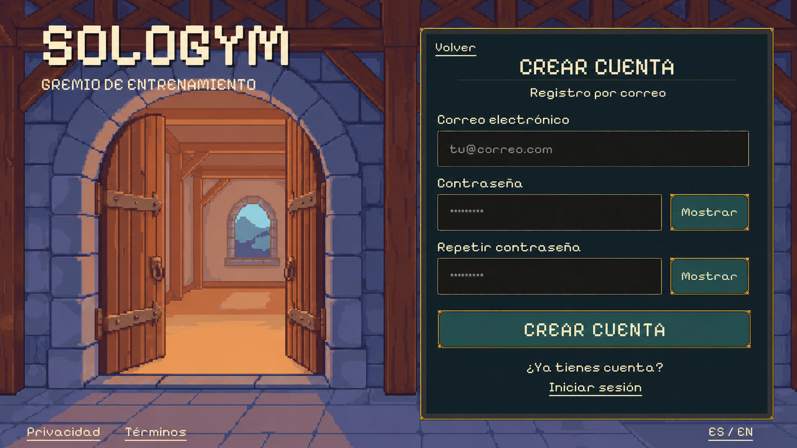

# Account creation — landscape concept

Status: **pending user visual review**, 2026-10-01. Prepared after the user
confirmed that login PR #32 was merged (`434c162`). No runtime code changed.

This is the email-registration branch of the existing login window. It reuses
the approved PixelLab guild entrance, logo composition and native control
style. The three fields are email, password and password confirmation, with
independent visibility buttons. The primary action creates an account; Back
returns to the preceding step and the sign-in link returns to login. Google
remains available through the existing provider entry on login.

The exact [prompt](screen-prompt.txt), original generated output and
[manifest](manifest.json) are preserved. The concept was produced with built-in
imagegen, not the CLI. No new PixelLab generation or character asset was needed.
The background remains `assets/sprites/pixellab/guild-entrance-r1/native/entrance.png`.

## Implementation boundary

After visual approval, deliver the complete working window in one PR, using
the original independent background and existing native uGUI skins. Labels,
fields, visibility toggles, validation, pending/cancel/retry states and navigation
remain live controls; never place this flattened render in runtime Resources.
Keep Spanish/English support, keyboard navigation, safe areas and small/wide
landscape verification from login.

Preserve the existing pre-registration age/residence and privacy flow
(`WIN-006` → `WIN-007` → email registration), including any required guardian
branch. This render depicts the credential step, not a replacement for those
gates. Final legal documents, regional policies, trusted receipts and connected
profile storage remain unfinished. Account creation must not bypass those
dependencies or open the fictional Home. An authentication identity alone
does not complete onboarding. Do not invent a new password policy or imply
consent through account submission.

The source/reference dimensions and hashes are recorded in the manifest.
Visual inspection found the text and controls readable with no overlap at the
render size. Native layout, service behavior and mobile interaction have not
been implemented or tested for this proposal.
