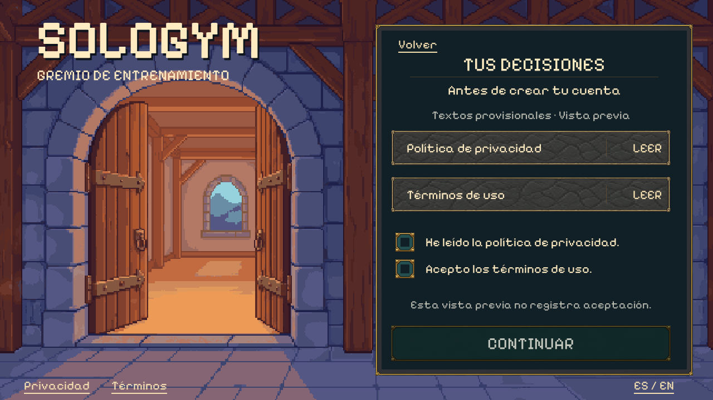
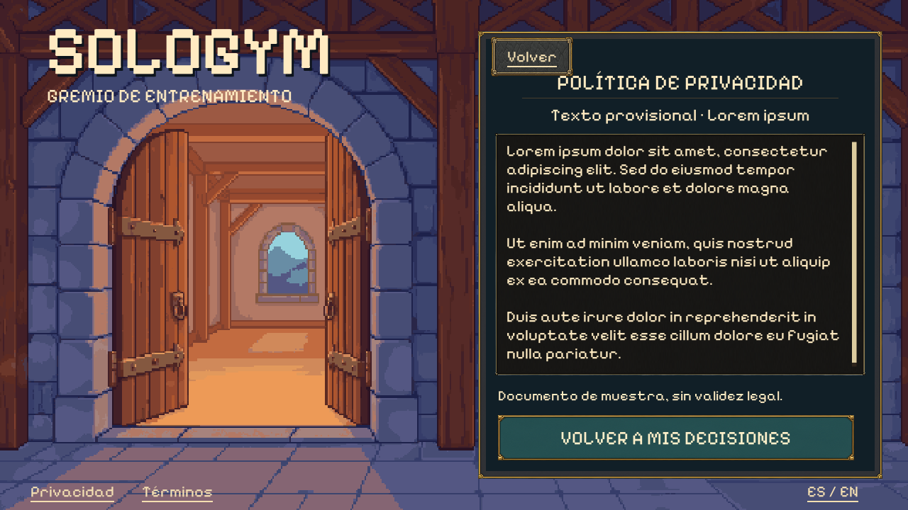

# Privacy and consent with provisional documents

The user approved both renders with **“implement.”** after authorizing Lorem ipsum
for terms and privacy. The complete consent screen and read-only reader are now
implemented in the native Unity guild shell, with the existing PixelLab background
and independent live controls. No new art or character generations were used.

[Approved consent concept](consent-concept.png) ·
[Approved reader concept](privacy-reader-concept.png) ·
[Exact prompts](consent-prompt.txt) / [reader prompt](reader-prompt.txt) ·
[Approval and source hashes](manifest.json)

## Actual Unity screens





[Small landscape](../../artifacts/visual/Consent/window-en-854.png) ·
[Wide reader](../../artifacts/visual/Consent/window-es-1600-privacy.png) ·
[Registration preview](../../artifacts/visual/Consent/window-es-1280-registration-preview.png) ·
[Missing documents](../../artifacts/visual/Consent/window-es-1280-missing-documents.png)

## Flow

Create account → age/country → character → **Your choices** → registration preview.
The previous consent-pending message is replaced by the approved screen. Both
independent checkboxes start empty; reading or scrolling never checks them. Both
choices and available review documents are required before continuing. The full
row of each document and checkbox is interactive, with native keyboard focus and
selected/disabled states. All headings, controls and messages support Spanish and
English; document bodies intentionally remain Latin Lorem ipsum.

The same reader opens from login, onboarding, consent and registration. Back returns
to its source; switching between documents retains that return route. Document scroll
position is remembered separately by document/language. Tab reaches the document
viewport; arrows, Page Up/Down and Home/End scroll it. Mouse wheel, scrollbar and
native ScrollRect dragging remain available. Long replacement copy scrolls inside
the existing panel. No scroll-to-bottom requirement is used as consent evidence.

Back from registration preserves email, age/country, character and review choices,
while clearing passwords. Sign-in/exit discards the setup draft. Changing age or
country clears both decisions; appearance changes, locale changes, reader visits
and backgrounding preserve them. An already signed-in identity goes to an explicit
profile-setup-pending screen after its review choices, never duplicate registration.

## Replaceable text and the production boundary

The runtime reads
[`ReviewDocuments.json`](../../app/Assets/SoloGym/Resources/Onboarding/ReviewDocuments.json).
Its four entries are privacy/terms × English/Spanish. Titles and bodies can be
edited without regenerating art. The original
[placeholder fixture](document-placeholders.json) remains as review evidence; its
bytes match this implementation's runtime resource. Keep provisional content
identified as such. Final production documents and their versioned receipts require
an explicit service integration, not changing a placeholder revision into a permit.

Review decisions are private, memory-only UI state. They do not modify the legacy
real-consent flags, write preferences or profiles, establish regional/guardian
eligibility, enable fasting or enter Home. The registration preview validates form
input locally, then shows an honest unavailable message and clears password fields.
It calls **neither** setup nor creation adapters, even if a ready adapter is injected.
The isolated account form's original trusted registration preflight is preserved.
Missing/malformed/non-review documents disable preview continuation and display a
localized reader fallback. Final legal copy is not needed to exercise this review.

## Verification

[Machine-readable verification](verification.json) records **724 passing checks**:
101 consent checks at each of ES 1280×720, EN 854×480 (12px inset), and ES 1600×720
(24px inset); 4 actual OS keyboard checks; and 122 login, 91 account and 204 onboarding
regression checks. The suite also invokes the existing real-policy/guardian checks.
It covers checkbox reversal, read-only documents, locale/back behavior, placeholder
registration isolation, signed-in continuation, eligibility-change resets, long
copy, missing documents and text fit. All eight character hashes and original
background/concept hashes remain unchanged.

Native screenshots were visually compared with both approved renders. Unity uses
the original background pixels and control skins rather than the concept's
approximations. Tests use private virtual displays and fictional drafts. Live
services and Android/iOS keyboard/touch behavior remain integration/device work.

## Local review

Build from this checkout:

```sh
/home/josue/Unity/Hub/Editor/6000.3.24f1/Editor/Unity -batchmode -nographics -quit \
  -projectPath "$PWD/app" -executeMethod SoloGym.Editor.PixelLoginBuild.BuildLinux \
  -logFile /tmp/sologym-consent-build.log
```

Open onboarding, enter age/country, and select a character to reach consent:

```sh
app/Builds/Login/SoloGymLogin.x86_64 -screen-fullscreen 0 \
  -screen-width 1280 -screen-height 720 -sologym-locale es -sologym-window onboarding
```

For the isolated native suite, use `-sologym-consent-smoke` with an absolute
`-sologym-capture` path, starting at login without a window flag. Real keyboard
verification is `python3 tools/check_pixel_field_keyboard.py --consent`; input is
sent only to a private Xvfb display. Existing account/login/onboarding fixtures
remain available. This iteration does not publish a backend or enable live sign-up.
