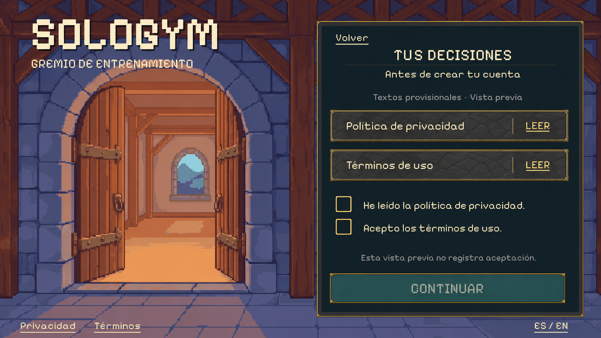
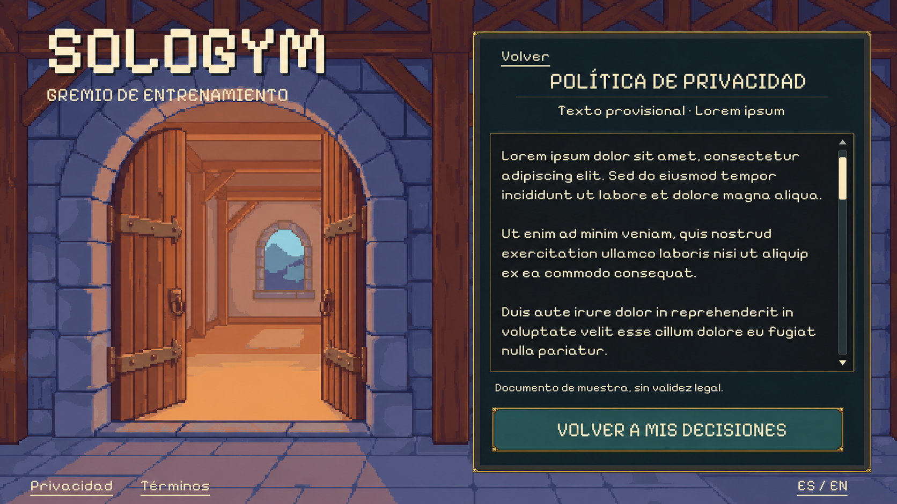

# Privacy and consent: provisional document review

After PR #34 merged, the user authorized **Lorem ipsum for terms and privacy**, to
be replaced later. This pack prepares the next complete screen and its document
reader in the existing landscape guild shell. Status: concepts ready for visual
review; no runtime or backend change in this pack.

The terms reader uses this same layout with its own title and document ID. It does
not need separate artwork. Both concepts were produced with built-in imagegen,
using the actual age/country screen and preserved PixelLab entrance as references.
The original background and controls will be reused in Unity; the concepts are
flattened targets, not replacement background/control exports. The generated
reference approximates the original art; production keeps the original pixels.
No new PixelLab jobs, characters or animations.

## Placeholder content

[document-placeholders.json](document-placeholders.json) contains four replaceable
fixtures: privacy/terms × English/Spanish. Each uses Latin placeholder body text,
a localized title, `isFinal: false` and a review revision. The visible interface
remains properly localized; only the document body uses Lorem ipsum.

The consent view starts with two empty decisions and separate document actions.
Reading a document never checks a box automatically. Return and locale changes
preserve the review draft. A preview can exercise continuation to the existing
registration form without treating placeholder decisions as trusted enrollment.
No real consent receipt, account-creation permit, eligibility approval or profile
save is supplied by this pack. Production enrollment still needs those services;
final legal copy is not required to build and review these UI states.

Final text can replace the fixture body without regenerating a screen image.
Production documents will need their own final status/version and service contract,
rather than reusing a review revision as a legal version.

[Consent prompt](consent-prompt.txt) · [Reader prompt](reader-prompt.txt) ·
[Sources, hashes and authorization](manifest.json)
