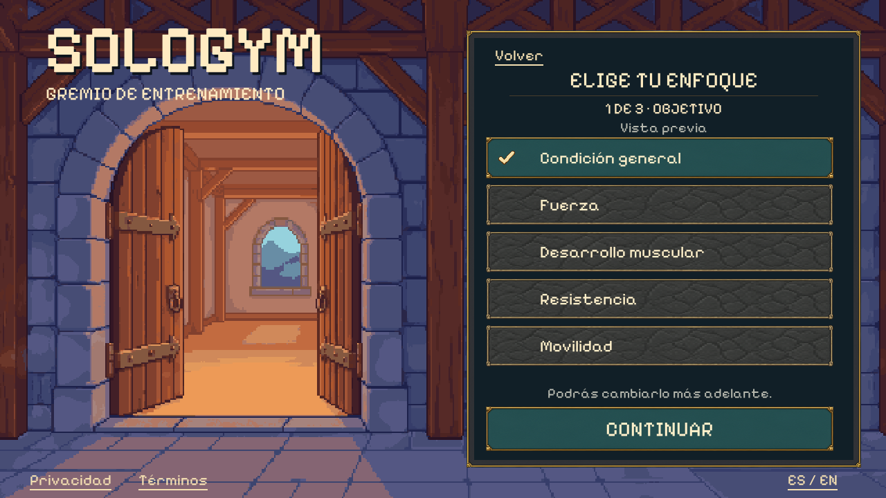
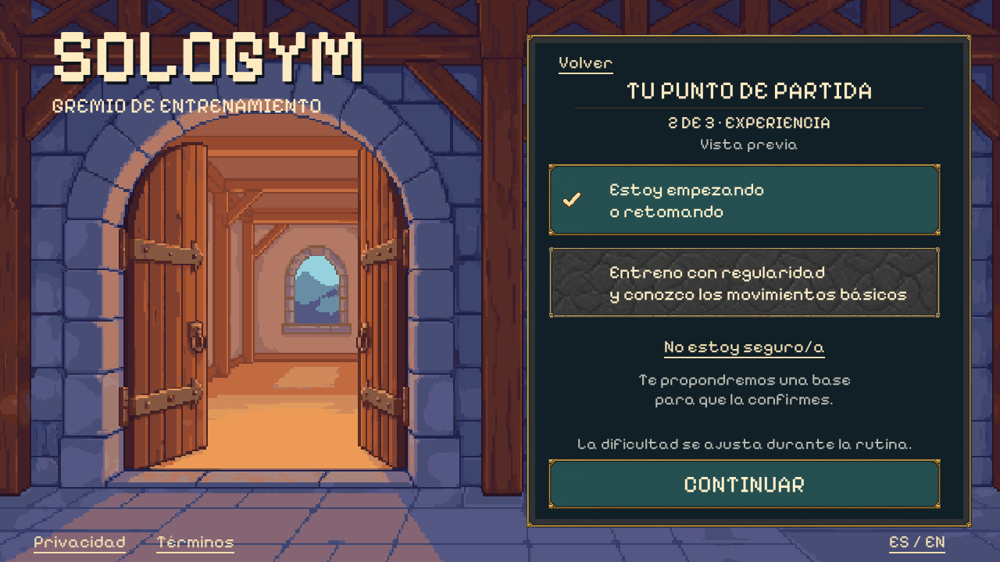
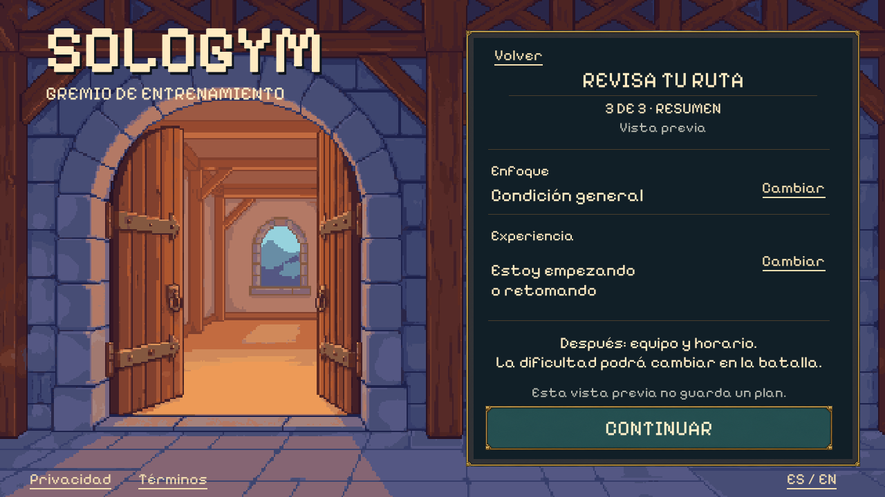

# Goals & Experience — fantasy landscape window

The user approved all three renders with **“good, do it.”** on 2026-10-01.
This complete native Unity window follows merged PR #36. It connects focus,
experience, beginner confirmation, summary editing and the pending equipment
checkpoint to the existing profile review.

## Native result







Approved concepts: [goal](01-goal-concept.png),
[experience](02-experience-concept.png), [summary](03-review-concept.png).
Exact imagegen prompts and original output hashes remain in [manifest.json](manifest.json).
The concepts' selections are fictional; actual initial choices are empty.

The original PixelLab entrance remains a separate background. Native uGUI
choices, text, actions and focus states reuse the existing sprite skins. No
background or character generation, sprite recoloring or animation was added.

## Connected behavior

- Ready or low-energy profile checkpoints continue into this window. Unknown or
  invalid age/country, incomplete consent and paused readiness cannot enter it.
- Adults receive all five existing catalog goals. Teen review receives only
  general fitness and mobility. Hidden adult choices remain invalid for teens.
- Focus alone does not select anything. Each step requires an explicit choice.
  Uncertainty opens a separate confirmation state; only confirming selects the
  beginner base. Back/cancel preserves the previous choice, including no choice.
- Summary actions reopen either choice. Back returns through experience and goal
  to readiness. Document visits and language changes preserve the current state,
  including an open confirmation or pending equipment checkpoint.
- Leaving setup, changing age/country or revoking consent clears dependent drafts.
  Appearance and optional measurements never infer goal, experience or difficulty.
  Selecting regular training does not unlock Hard; battle difficulty retains its
  existing adjustable behavior and limits.
- Continue from summary currently shows the pending **Equipment (WIN-011)** step.
  Equipment and schedule/session length remain subsequent window work.
- This is a memory-only review. It creates no account, saves no profile, generates
  no workout and issues no rewards or production authorization.

The existing [catalog](../../app/Assets/SoloGym/Resources/GoalsExperience/Catalog.json)
retains its IDs and bytes. The domain controller gained a reset method for
parent-flow invalidation; its training rules are unchanged. The old
[functional specification](../../docs/windows/WIN-010-goals-experience-g0.md)
remains applicable to behavior, with its portrait presentation superseded here.

## Verification and local review

[verification.json](verification.json) records the final build, native smoke
reports, keyboard probe, regressions and preserved source hashes. Native captures
cover ES 1280×720, EN 854×480 with a 12px inset and ES 1600×720 with a 24px inset.
The smoke checks include real pointer hit targets, text bounds and first-open
confirmation actions; the keyboard driver uses an isolated Xvfb display.

From this worktree, build and open an explicitly fictional adult review:

```bash
/home/josue/Unity/Hub/Editor/6000.3.24f1/Editor/Unity \
  -batchmode -nographics -quit -projectPath "$PWD/app" \
  -executeMethod SoloGym.Editor.PixelLoginBuild.BuildLinux \
  -logFile /tmp/sologym-goals-build.log

app/Builds/Login/SoloGymLogin.x86_64 \
  -screen-fullscreen 0 -screen-width 1280 -screen-height 720 \
  -sologym-locale es -sologym-window goals -sologym-review \
  -sologym-review-age 21
```

Use review age `17` for teen choices. Missing/invalid age stops at onboarding;
the shortcut cannot infer adult eligibility. Normal startup remains login.
For the connected path, complete age/country, character and provisional consent,
open the registration form's explicit profile preview, complete readiness and
continue to goals. No credentials or live service are required for that preview.

Keyboard regression:

```bash
python3 tools/check_pixel_field_keyboard.py --goals
```
