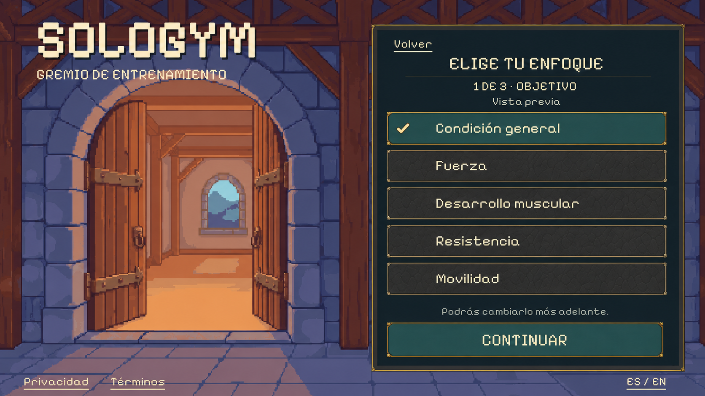
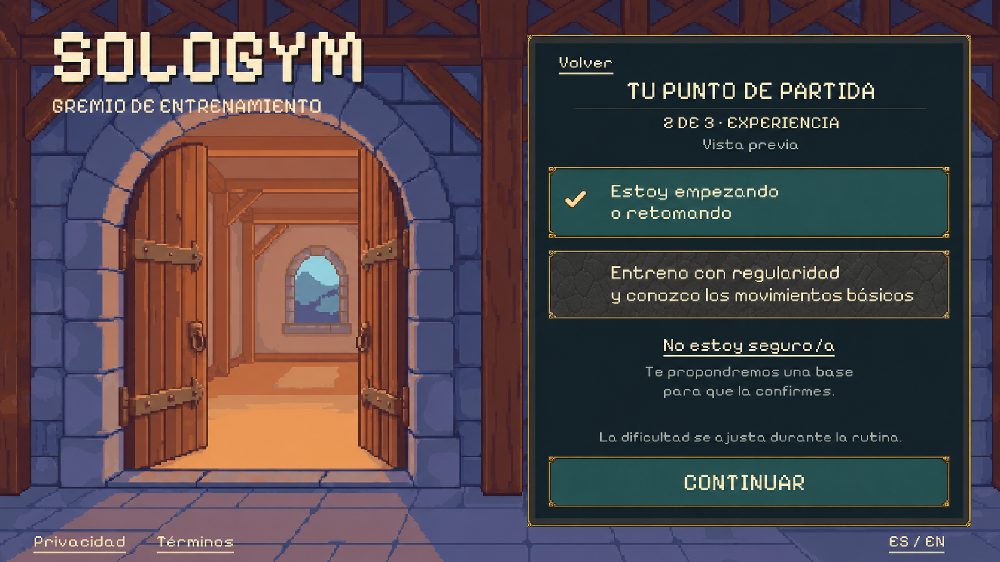
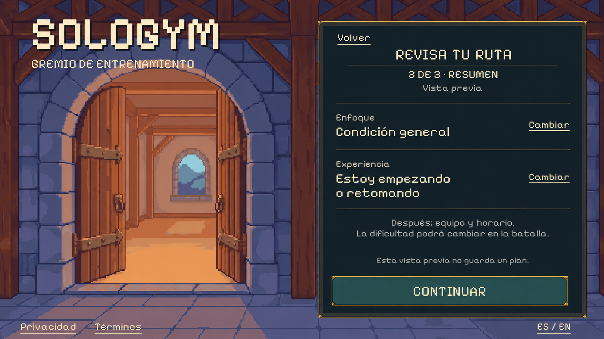

# Goals & Experience — fantasy landscape proposal

Status: **awaiting visual review**, 2026-10-01. Follows merged PR #36.
One complete window contains the goal, experience and review steps. Render
approval precedes native implementation and verification in a single PR.

## Proposed screens

The three concepts use a fictional adult choosing general fitness and a beginner
starting point. Real initial selections remain empty. The summary reflects the
same example choices. No real profile or routine has been created.

The backdrop is the existing PixelLab guild entrance. Typography, selectable
rows, frame, selected checkmark and primary action match the actual private
profile window from PR #36. No new background, character or animation generation
is needed. Native implementation must retain the original independent background
and live controls, not use these flattened images as screen textures.

## Existing behavior and data

Use the unchanged [catalog](../../app/Assets/SoloGym/Resources/GoalsExperience/Catalog.json)
and [controller](../../app/Assets/SoloGym/Scripts/GoalsExperienceState.cs).
The [existing window specification](../../docs/windows/WIN-010-goals-experience-g0.md)
remains the functional reference; this landscape proposal replaces its old
portrait styling only after approval.

- Adult goals: general fitness, strength, muscle growth, endurance and mobility.
- Experience: starting/returning or regular training with basic-movement knowledge.
- “I'm not sure” opens the existing beginner confirmation. Confirming chooses the
  beginner starting point; cancelling preserves the draft. Reuse the same panel
  and native actions for this conditional state, with the existing EN/ES copy.
- The teen review presents only general fitness and mobility under current
  product rules. Unknown age must not establish adult eligibility.
- Appearance and private body measurements do not infer training experience,
  goal or difficulty. Intermediate does not grant automatic Hard access.
- Easy/Medium/Hard remains changeable during a routine within existing rules.
  This setup step selects experience, not a locked difficulty.
- Review lets the player edit either choice. Continue leads to available
  equipment; schedule/session length still follows before preparing sessions.
- Back, reader visits and locale changes retain the draft; exit/reset discards it.
  Preserve upstream readiness pauses, age/consent and production authorization.
- No production profile persistence, routine generation, rewards or Home entry
  is established by this review UI.

## References and handoff

Generated with **built-in imagegen**, not the CLI. Exact prompts:
[goal](01-goal-prompt.txt), [experience](02-experience-prompt.txt),
[review](03-review-prompt.txt). [manifest.json](manifest.json) records original
outputs, dimensions, SHA-256 hashes and native/catalog references.

All three images were inspected for composition, Spanish text, agreement between
example selections and summary, and control spacing. They are 1672×941.
No code or imported production assets changed, and no build/runtime tests were
run for this concept-only step. After approval, validate the native window at
standard, small and wide landscape sizes, including uncertainty confirmation,
teen choices, edit/back paths, keyboard navigation and unchanged profile gates.
