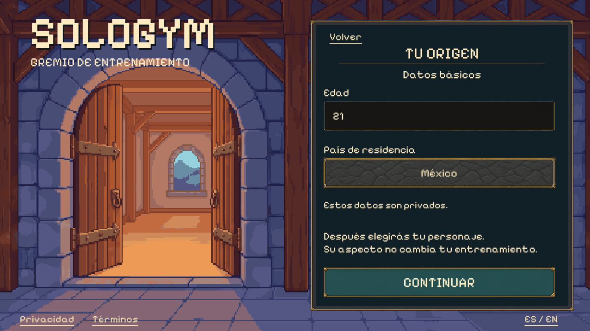
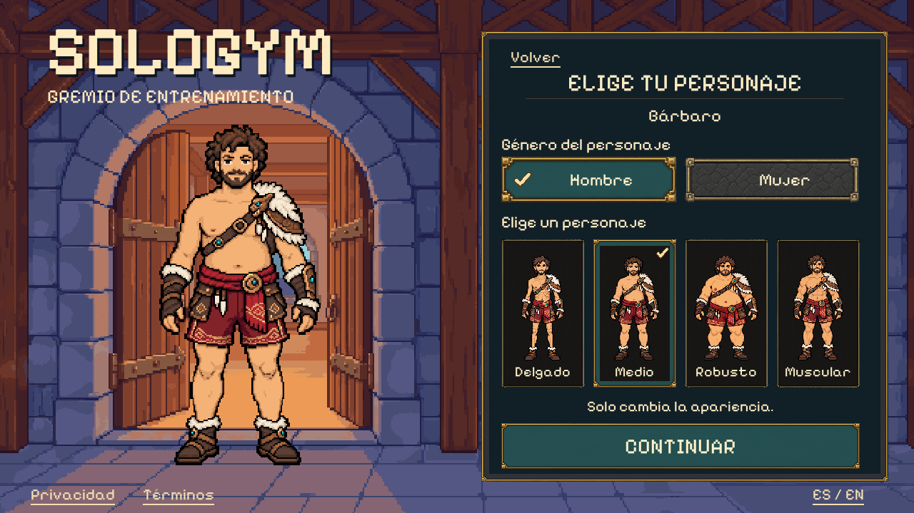

# Combined onboarding: age/country and character

The user requested both steps in **one PR** after account PR #33 merged:
“lets build the age, country and character selection in one go”. This combines
related onboarding work while retaining the render-first review process.

Status: both renders approved on 2026-10-01 (“great, love it, build it”) and
implemented together in the native Unity login shell. The concepts use built-in imagegen, the existing PixelLab guild
entrance and the approved male character references. There are no new PixelLab
jobs or replacement character exports.

## Approved screens


Age and country are private draft fields. The concept shows fictional values
21/Mexico; the real form starts empty and country is explicitly selected, never
inferred from language or GPS. Retain existing minimum-age validation and any
applicable regional requirements. Continue goes to the cosmetic character draft;
this transition does not assert verified age, regional eligibility or consent.


Choose the character's gender, then one complete existing Barbarian appearance.
The four cards are skinny, medium, heavy and muscular; changing gender displays
the other four approved sprites. The large preview and cards use the same source
assets, preserving proportions and a consistent feet anchor. Selection does not
represent the user's gender or prescribe training, health attributes or power.
There are no color, outfit, hair, equipment or body-proportion editors. Other
classes and animations remain outside this batch.

The concept image approximates source pixels and background softness. Production
must reuse the original 256×256 character PNGs and PixelLab background unchanged,
with point filtering and live text, cards, fields and buttons. Do not extract
characters, UI textures or backgrounds from these flattened concepts.

## Implementation and boundaries

“Create account” now opens the empty age/country draft. A trusted sign-in destination
of WIN-006 opens the same flow; other trusted pending destinations retain their
existing checkpoint. Continue validates the existing age-15+ boundary and an
explicit catalog country, then opens character selection. The searchable country
picker supports names, accents, ISO codes, no results, pointer, Tab and Return.
The country catalog is display data, not a launch eligibility allowlist.

Gender changes the four appearance cards and large preview. Native single-choice
controls keep focus distinct from selection; arrows move focus and Return selects.
The optional sprite-card presentation preserves standard difficulty-control behavior.
All previews use the original 256×256 PixelLab PNGs at a shared source scale and
catalog feet anchor. No new art, animation, generation credits or recoloring.

Back/forward, Spanish/English and visits to read-only legal documents preserve the
memory-only draft. Exiting to login clears it. Backgrounding closes the picker and
keyboard. No age/country or appearance is written to PlayerPrefs or a profile;
the existing shared language preference is retained. Normal screens fit without
scrolling; errors and keyboard occlusion use the existing scroll behavior.

The last Continue opens an explicit **privacy/consent setup pending** checkpoint.
It does not accept unavailable documents, issue a registration permit, establish
regional/guardian eligibility, enable fasting, prescribe training or enter fictional
Home. Production consent/eligibility and profile persistence remain future work.
The previously merged email credential form remains available via
`-sologym-window account` for isolated review; its trusted preflight is unchanged.

## Native captures and verification





[Female selection](../../artifacts/visual/Onboarding/window-es-1280-female-medium.png) ·
[Small landscape](../../artifacts/visual/Onboarding/window-en-854-female-fat.png) ·
[Wide landscape](../../artifacts/visual/Onboarding/window-es-1600-female-muscular.png) ·
[Consent boundary](../../artifacts/visual/Onboarding/window-es-1280-privacy-pending.png)

[Verification and hashes](verification.json) records 981 reported passing checks:
209 onboarding checks at each of 1280×720 ES, 854×480 EN (12px simulated inset),
and 1600×720 ES (24px inset); 5 actual OS keyboard checks; 119 login, 91 account
and 139 shared choice-control regression checks. The onboarding suite also calls
the existing policy/consent/guardian state checks. All eight source/runtime hashes
and the guild background match their preserved originals. Native captures were
compared with both approved concepts; original source pixels replace the concept's
approximated art and softness. Mobile keyboard geometry is simulated; actual
Android/iOS IMEs and live services remain device/integration work.

## Local review

From this checkout, build with Unity 6000.3.24f1:

```sh
/home/josue/Unity/Hub/Editor/6000.3.24f1/Editor/Unity -batchmode -nographics -quit \
  -projectPath "$PWD/app" -executeMethod SoloGym.Editor.PixelLoginBuild.BuildLinux \
  -logFile /tmp/sologym-onboarding-build.log
```

Open the new age/country step (omit the window flag to start at login):

```sh
app/Builds/Login/SoloGymLogin.x86_64 -screen-fullscreen 0 \
  -screen-width 1280 -screen-height 720 -sologym-locale es -sologym-window onboarding
```

Run the onboarding smoke pass with `-sologym-onboarding-smoke` and an absolute
`-sologym-capture` path, starting from login without a window flag. It uses only
fictional local drafts. Real keyboard verification runs with
`python3 tools/check_pixel_field_keyboard.py --onboarding` on a private virtual
display; it never types into the user's desktop. Existing `--login` and `--account`
fixtures remain available. Build/run the standard choice fixture with
`SoloGym.Editor.PixelChoiceBuild.BuildLinux` and `-sologym-smoke`.

[Age/country prompt](age-country-prompt.txt) · [Character prompt](character-prompt.txt) ·
[Originals, approval and unchanged roster](manifest.json)
