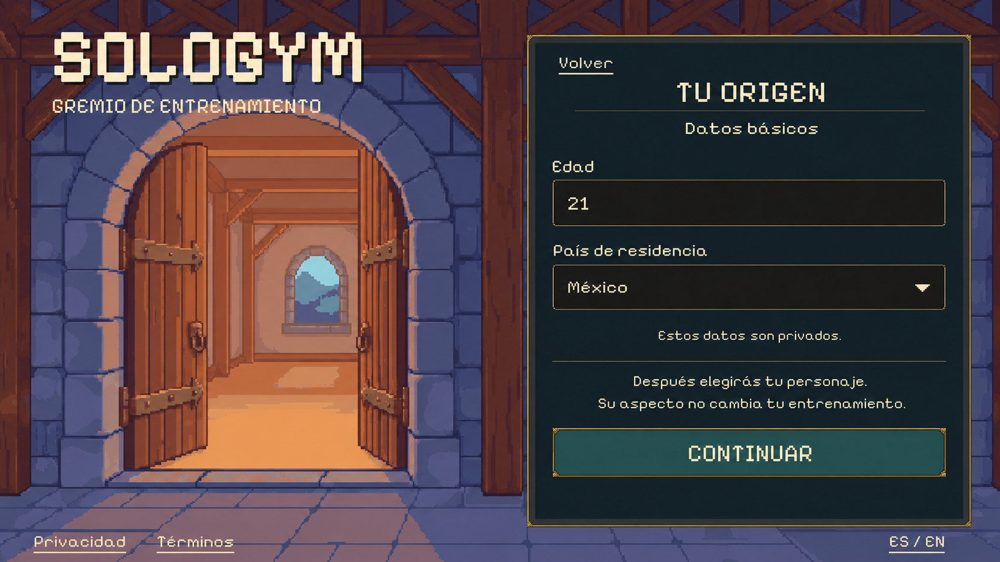
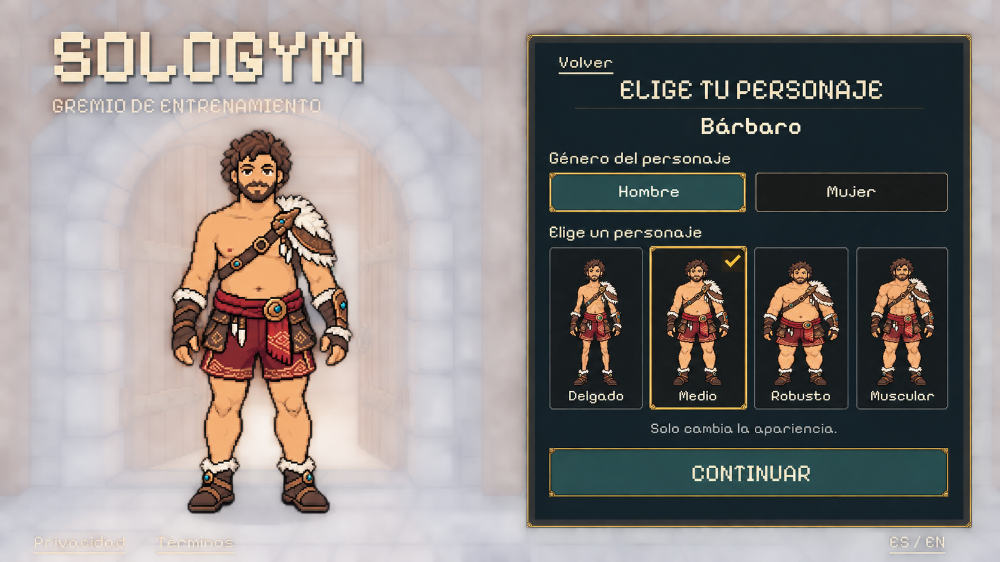

# Combined onboarding: age/country and character

The user requested both steps in **one PR** after account PR #33 merged:
“lets build the age, country and character selection in one go”. This combines
related onboarding work while retaining the render-first review process.

Status: two proposed full-screen layouts, pending visual approval. No runtime
changes yet. The concepts use built-in imagegen, the existing PixelLab guild
entrance and the approved male character references. There are no new PixelLab
jobs or replacement character exports.

## Proposed screens

Age and country are private draft fields. The concept shows fictional values
21/Mexico; the real form starts empty and country is explicitly selected, never
inferred from language or GPS. Retain existing minimum-age validation and any
applicable regional requirements. Continue goes to the cosmetic character draft;
this transition does not assert verified age, regional eligibility or consent.

Choose the character's gender, then one complete existing Barbarian appearance.
The four cards are skinny, medium, heavy and muscular; changing gender displays
the other four approved sprites. The large preview and cards use the same source
assets, preserving proportions and a consistent feet anchor. Selection does not
represent the user's gender or prescribe training, health attributes or power.
There are no color, outfit, hair, equipment or body-proportion editors. Other
classes and animations remain outside this batch.

The concept image approximates source pixels and background softness. Production
must reuse the original 256×256 character PNGs and PixelLab background unchanged,
with point filtering and live text, cards, fields and buttons. Do not extract
characters, UI textures or backgrounds from these flattened concepts.

## One implementation and one PR

Implement both steps with a shared draft and shell, Spanish/English, Back/Continue,
validation, keyboard and pointer support, cancellation and preserved draft values
when moving between the two steps. Keep age/country memory-only until the proper
trusted profile/consent flow can save them. A local appearance choice is not an
account-wide profile save. Retain the existing read-only legal-document entry.

Choosing an appearance can precede private fitness setup. Final enrollment still
requires the applicable eligibility/consent/guardian steps and backend persistence;
do not turn appearance confirmation into a registration permit, adult fasting
access, a personalized training plan or a route into fictional Home data. Those
dependencies remain explicit rather than being treated as satisfied by this UI.

Validate all eight original sprite choices, draft back/forward/exit behavior,
invalid age/country and missing-service cases. Compare native captures to both
concepts at small, standard and wide landscape sizes. Ship the connected batch
in a single PR after implementation and focused verification.

[Age/country prompt](age-country-prompt.txt) · [Character prompt](character-prompt.txt) ·
[Originals, hashes and unchanged character roster](manifest.json)
