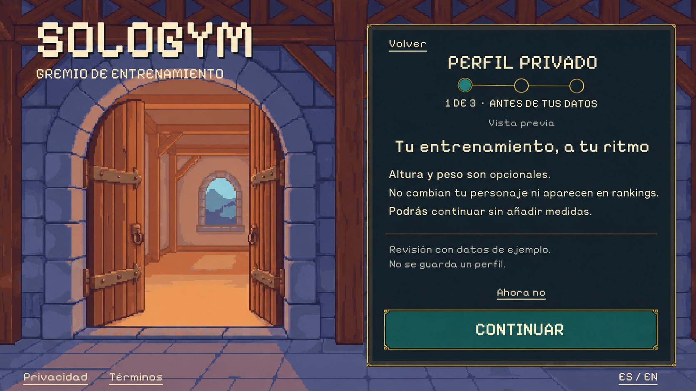
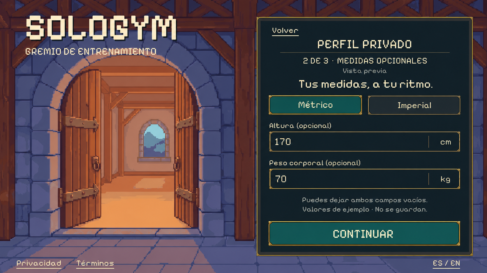
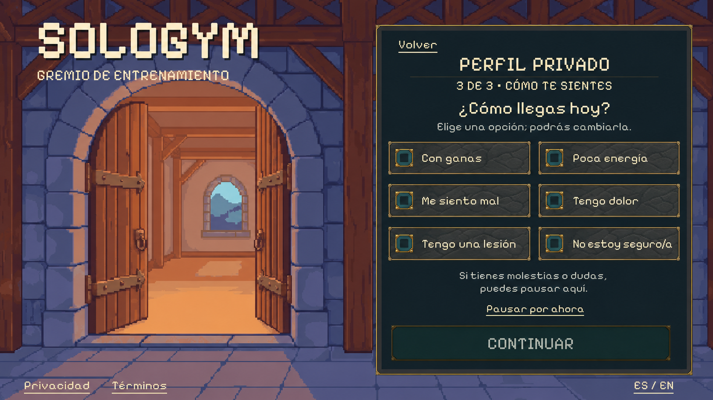

# Private fitness profile — fantasy landscape proposal

Status: **awaiting visual review**, 2026-10-01. Follows merged PR #35.
This is one complete window with three connected steps. No runtime changes or
implementation PR yet: review the render, then build and verify the whole window.

## Proposed screens

1. **Before your data:** optional measurements, independent character appearance,
   private visibility and an easy exit.
2. **Measurements:** metric/imperial selection, optional height and bodyweight,
   with clear units and a Continue action that also permits blank fields.
3. **How you feel:** one current response from six choices, with a pause action.
   This does not begin a routine.

## Reused artwork and controls

Generated using built-in imagegen, not the CLI. Exact prompts are
[notice](01-notice-prompt.txt), [measurements](02-measurements-prompt.txt) and
[readiness](03-readiness-prompt.txt). Original generated files, dimensions and
SHA-256 hashes are recorded in [manifest.json](manifest.json).

The background is the existing 640×360 PixelLab guild entrance:
[original asset](../../assets/sprites/pixellab/guild-entrance-r1/native/entrance.png).
The style anchor is the actual native consent capture from PR #35. No PixelLab
generation, new character art or animation was requested. All eight Barbarians
are unchanged.

These are flattened references only. Implementation will reuse the independent
background, frame, unit choice control, fields, selectable rows and primary button
with live text and interaction states. Keep the original native source pixels;
do not extract runtime background/control art from these concepts.

The 1672×941 images were visually inspected for readable Spanish, composition,
controls and overlap. Use the measurements reference's simpler text-only step
header on every step; the notice-only progress circles are optional concept
decoration. Keep a small review marker on all prototype states (the readiness
image omitted it). Verify native captures at standard, small and wide landscape
sizes during implementation.

## Existing behavior to preserve

The prior profile state and requirements remain the functional reference:
[PrivateProfileState.cs](../../app/Assets/SoloGym/Scripts/PrivateProfileState.cs)
and [WIN-009](../../docs/windows/WIN-009-private-fitness-profile-g0.md). Their old
portrait art is superseded by this proposal only after visual review.

- 170 cm / 70 kg are fictional review values, never inferred user data or mandatory
  defaults. Normal entry starts empty; both optional values can remain absent.
- Unit presentation preserves canonical values; invalid text remains available
  for correction. Language changes and Back preserve the draft.
- Measurements never change character appearance, classify the user, grant
  strength or determine a routine. No BMI, calorie, diet or weight-goal feature.
- Readiness is mutually exclusive and initially unset. Pain, injury, illness or
  uncertainty leads to a pause. Ready/low energy continues setup, not exercise.
  Check readiness again before a later workout, preserving existing youth rules.
- Experience/goals, equipment and schedule follow in their own windows.
  Difficulty remains changeable during a boss routine.
- Leaving/reset discards the in-memory draft. No private fitness values enter
  public identity, rankings or chat. This stage adds no profile persistence.

## Preview and production boundary

PR #35's registration preview does not create an identity or establish trusted
eligibility. Keep profile review isolated from a real profile. Continue cannot
convert provisional legal checkboxes into a production health-data decision or
account permit.

Preserve existing policy/authorization boundaries before real measurement entry.
Any separate health-data decision required by reviewed production policy stays
separate from general terms. Final copy does not block the render or review flow.
Do not imply that height/weight already feed the training generator; its current
schema does not require them.

No build or runtime tests were run for this concept-only change. Domain,
interaction and responsive-layout checks follow after visual review. No code
or imported production assets changed.
