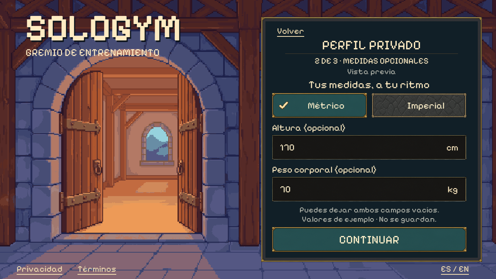
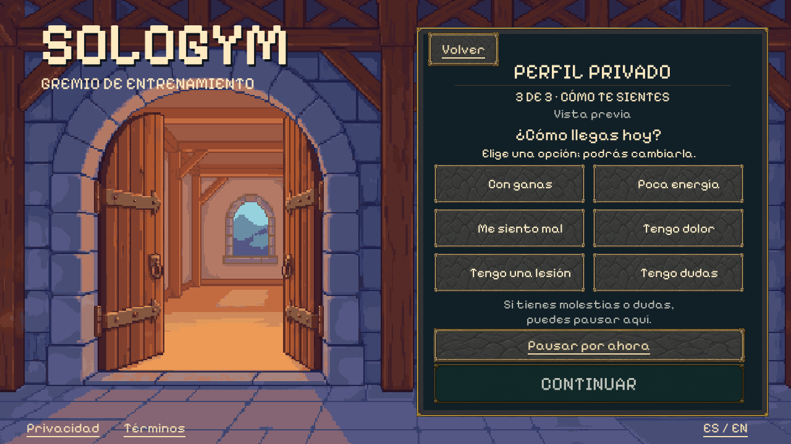

# Private fitness profile — approved native window

The user approved all three landscape concepts with **“do it”** on 2026-10-01.
The complete native window follows merged PR #35, using the existing PixelLab
guild entrance and shared uGUI controls. It includes notice, optional measurements,
readiness, pause and the next-setup checkpoint in one implementation.

## Native captures





[Notice](../../artifacts/visual/Profile/window-es-1280-notice.png) ·
[Imperial](../../artifacts/visual/Profile/window-es-1280-imperial.png) ·
[Invalid values](../../artifacts/visual/Profile/window-es-1280-invalid.png) ·
[Paused](../../artifacts/visual/Profile/window-es-1280-paused.png) ·
[Next setup](../../artifacts/visual/Profile/window-es-1280-checkpoint.png) ·
[Small English landscape](../../artifacts/visual/Profile/window-en-854.png) ·
[Wide landscape](../../artifacts/visual/Profile/window-es-1600.png)

The main measurements state fits without scrolling. Long validation messages and
software-keyboard layouts scroll inside the panel. Native controls keep focus,
pointer targets and text separate from the background. The compact Spanish
uncertainty label is “Tengo dudas”; it retains the existing unsure/pause behavior.
All steps use the same text-only progress header and explicit preview marker.

## Connected flow

- Reviewed age/country and character selection lead to consent, as in PR #35.
- Signed-in identity setup now continues from provisional consent to the profile
  notice instead of the old pending-profile message. This remains a review.
- The provisional email-account form offers **Preview private profile** below
  Sign in. It does not require entering credentials; using it clears any password
  draft and makes no account-creation call. The trusted standalone account form
  does not expose this review link.
- Back returns through profile steps to the same account or consent view.
  Document links reuse the existing reader and return to the same profile draft,
  including invalid input, units, readiness and validation messages.
- Not now / Leave preview discards the private review and onboarding drafts.
  Age/country changes and revoking review consent also clear the profile draft.
  Backgrounding releases the keyboard; locale changes retain non-secret edits.

## Domain behavior

The existing [PrivateProfileController](../../app/Assets/SoloGym/Scripts/PrivateProfileState.cs)
remains responsible for optional values, conversion, validation and readiness.
[PixelPrivateProfileWindow](../../app/Assets/SoloGym/Scripts/UI/Pixel/PixelPrivateProfileWindow.cs)
provides the new presentation. The controller adds explicit Reset and Pause
operations without changing its production authorization boundary.

The review fixture loads 170 cm / 70 kg only after the notice. These are labelled
fictional examples. Both values can be cleared and remain absent through unit
changes; neither is inferred from the character. Real-mode state still begins
empty and cannot collect measurements without the existing production policy and
authorization requirements.

Metric/imperial conversions retain canonical decimal cm/kg values, avoiding
round-trip drift. Imperial height uses separate feet and inches. Malformed input
remains visible for correction, blocks Continue and reports a readable message.
Switching units never silently discards an invalid edit.

Readiness begins unselected. Focus is distinct from selection, and exactly one
choice is retained once chosen. Pain, injury, illness or uncertainty leads to a
pause; the explicit pause action is also available. Ready/low energy reaches only
the next-setup checkpoint. Neither path starts a routine, diagnoses a condition,
grants rewards or carries readiness approval into a future workout.

## Preview boundary and remaining integration

The general documents remain the user-authorized Lorem ipsum from PR #35.
Their review decisions do not establish identity, eligibility or a production
health-data decision. This window stores its draft only in memory, adds no cloud
or local profile persistence and never opens sample Home or creates a workout.
Any separate health-data decision required by reviewed production policy remains
separate from general terms. Final legal text is not a prerequisite for this
approved review UI.

Appearance is unchanged. Measurements do not classify the user, change game
strength or prescribe exercise; the current generator does not require them.
Goals/experience, equipment and schedule still follow. Boss difficulty remains
changeable during a routine. Trusted production setup, youth-policy integration,
profile persistence and device checks remain separate work.

## Verification

Unity 6000.3.24f1 Linux standalone build succeeded. **1,068 reported checks passed:**

- Profile: 182 each at ES 1280×720, EN 854×480 with 12px inset, and ES 1600×720
  with 24px inset.
- Actual OS keyboard: 4 checks for decimal entry, focus traversal, readiness,
  pause and Back on a dedicated Xvfb display.
- Regressions: login 122, account 91, consent 101, onboarding 204.

Checks include existing production gates and exact conversions, optional blanks,
invalid values across document/locale returns, mutually exclusive readiness,
all pause routes, simulated keyboard clearance, appearance independence, draft
reset and no Home/account side effects. All player runs exited successfully;
no runtime exceptions appeared in the final logs. Touch and Android/iOS software
keyboards still need device testing.

Reports and screenshot hashes are in [verification.json](verification.json).
All original concept/prompt/background hashes and the eight character hashes were
verified unchanged. No new art was generated for implementation.

## Build and open

From the repository/worktree root:

```sh
/home/josue/Unity/Hub/Editor/6000.3.24f1/Editor/Unity -batchmode -nographics -quit \
  -projectPath "$PWD/app" -executeMethod SoloGym.Editor.PixelLoginBuild.BuildLinux \
  -logFile /tmp/sologym-profile-build.log
app/Builds/Login/SoloGymLogin.x86_64 \
  -screen-fullscreen 0 -screen-width 1280 -screen-height 720 \
  -sologym-review -sologym-window profile -sologym-locale es
```

The direct profile entry requires `-sologym-review`; otherwise it opens login.
Omit the window flag to test the connected flow from login. The old portrait
review remains available with `-sologym-legacy-profile -sologym-window profile
-sologym-review`.

Use `-sologym-profile-smoke -sologym-capture "$PWD/artifacts/visual/Profile/window.png"`
from the default login entry for the native suite. Keyboard verification is
`python3 tools/check_pixel_field_keyboard.py --profile` and never targets the
user's desktop. Captures and smoke runs isolate authentication from live services.

## Preserved concepts

[Notice](01-notice-concept.png), [measurements](02-measurements-concept.png) and
[readiness](03-readiness-concept.png) remain visual references, not runtime assets.
They were generated with built-in imagegen. Exact prompts:
[notice](01-notice-prompt.txt), [measurements](02-measurements-prompt.txt),
[readiness](03-readiness-prompt.txt). The [manifest](manifest.json) preserves
original files, approval and hashes. Runtime uses independent original background
and sprite skins with live labels and controls; it does not extract art from the
flattened concepts.
