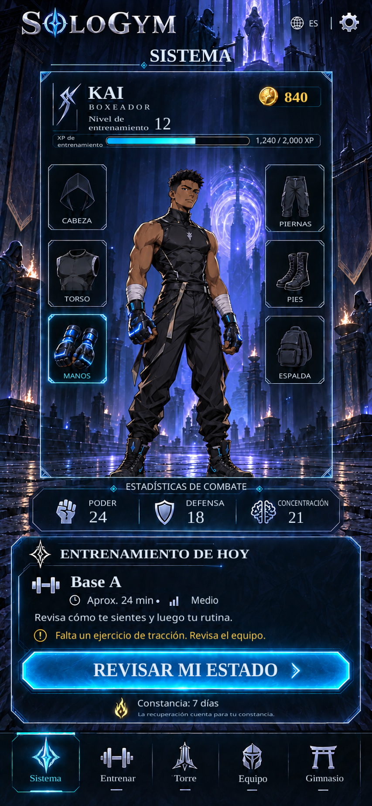

# WIN-001 — native implementation and visual comparison

The user approved proposal v2 and requested complete-window construction before focused visual testing, using reference pixel coordinates and shared components. That instruction supersedes the earlier per-asset approval stops for this implementation. The original EN/ES target PNGs remain unchanged and versioned.

## Implemented

- Unity 6000.3.24f1 native project, portrait layout and Android build configuration.
- One shared source-art atlas and one cleaned plate, with 109 mapped regions and measured foreground text bounds. Native labels, values, XP fill and controls remain editable.
- English/Spanish device detection and persistent choice, with a shared artwork set.
- A single Today panel supporting training, recovery, saved sessions, completed sessions, setup, review, loading, errors and independent connection state.
- Saved-session routing through readiness, teen supervision review, protected recovery presentation and an offline social-Gym notice.
- Real UI controls for navigation, language and settings. Future windows are explicitly unavailable; this milestone does not implement their contents.
- Static character/equipment illustration matching the approved Home fixture. Modular avatar sprites, appearance changes and gear fitting are not implemented by this illustration.

## Verification approach

The complete player was built before the first visual capture. A focused correction pass addressed typography widths/placement, Spanish overflow and a clock artifact from the clean plate. Pixel bounds were then measured from the approved source to align live text. There are no per-button rendering scenes or broad new unit-test suite.

The native player passed [five focused interaction checks](../../artifacts/visual/WIN-001/home-en-final.smoke.json) during a full-screen capture: language selection, saved-session readiness routing, illness recovery, teen supervision and offline Gym messaging. The training-data test suite was not rerun for this UI-only change. Comparison files contain actual Unity player captures, a 50% overlay and an amplified difference image against each approved locale reference.

**The visual target is 1:1; a live-font reconstruction must not be described as byte-identical to an AI raster.** Shared artwork uses the original source pixels outside cleaned text regions. Remaining differences can come from the bundled font shapes/rasterization, reconstructed glass beneath text, the mathematically exact 62% XP fill, and minor artwork differences between the independently generated EN/ES proposal images. Both runtime locales intentionally share the English source artwork. The comparison metrics record these differences without declaring an automatic pass.

## Scope and delivery

The runnable deliverable is the Home window with fictional local data. Linux and Android builds succeeded; the local ARM64 Android APK is approximately 21 MB and uses debug signing. No actual mobile-device check has been performed. No iOS binary is built on this Linux host, and iOS behavior is unverified. The [app README](../../app/README.md) contains exact build and capture commands. The other 63 windows remain unimplemented.

Larger text, other aspect-ratio layouts, native screen-reader support, production account/backend connections, and full destination screens remain their respective milestones. Standard portrait safe-area fitting is present now.

The [approved images](../../design/reference-manifests/WIN-001-system-home-v2.json), [runtime asset provenance and hashes](../../design/reference-manifests/WIN-001-runtime-assets.json), [pixel mapping](../../design/mapping/WIN-001-home-map.json), [runtime controller](../../app/Assets/SoloGym/Scripts/HomeState.cs) and [screen assembly](../../app/Assets/SoloGym/Scripts/HomeScreen.cs) stay in the repository for subsequent work.

## Current visual evidence

All captures and references use **853 × 1844 pixels**, with no resizing or image registration in the comparison. Values below describe RGB differences on a 0–255 scale; the within-8 percentage is not an acceptance threshold.

| Locale | Actual player | Reference comparison | Mean absolute RGB difference | Pixels with maximum channel difference ≤ 8 |
| --- | --- | --- | ---: | ---: |
| English | [Final capture](../../artifacts/visual/WIN-001/home-en-final.png) | [Side by side](../../artifacts/visual/WIN-001/comparison-en.side-by-side.png) · [Overlay](../../artifacts/visual/WIN-001/comparison-en.overlay.png) · [Metrics](../../artifacts/visual/WIN-001/comparison-en.metrics.json) | 4.1887 | 91.7185% |
| Español | [Captura final](../../artifacts/visual/WIN-001/home-es-final.png) | [Comparación](../../artifacts/visual/WIN-001/comparison-es.side-by-side.png) · [Superposición](../../artifacts/visual/WIN-001/comparison-es.overlay.png) · [Métricas](../../artifacts/visual/WIN-001/comparison-es.metrics.json) | 7.4626 | 77.9612% |

The reference is on the left and the actual native player is on the right in each side-by-side image. The lower Spanish agreement also reflects artwork differences in the independently generated Spanish target; runtime locales share the English artwork. Full-screen visual review and these measurements do not record user acceptance of a strict 1:1 match.

