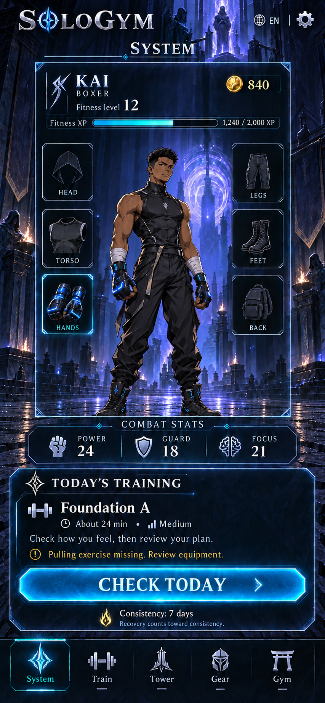
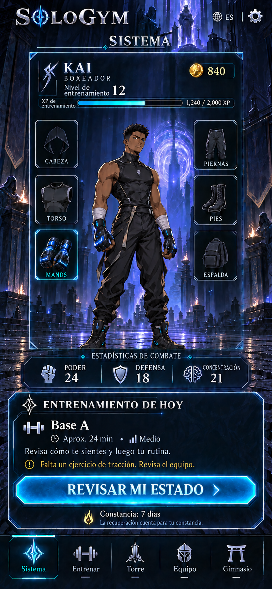

# WIN-001 — System / Home: flow and data approval

**Stage: v2 visual target approved; native Home implemented for visual review.** The two versioned images below remain the immutable 1:1 work reference. The user's latest instruction authorized complete-window construction with pixel mapping before focused full-screen checks, superseding the earlier per-asset stops for WIN-001. See the [implementation and comparison evidence](WIN-001-implementation.md). Runtime visual acceptance is not recorded as a strict 1:1 pass. The training data shape is accepted for design; exercise content review remains pending.

## Rendered proposal — retained visual target

**English · WIN-001 / adult training / online / v2**

[Open original English PNG](../../design/renders/WIN-001-system-home-en-proposal-v2.png)

**Español · WIN-001 / entrenamiento adulto / en línea / v2**

[Abrir PNG original en español](../../design/renders/WIN-001-system-home-es-proposal-v2.png)

Both renders show the same male Boxer, base outfit, gauntlets, temple, six slots and fictional data. The prior data-only female placeholder is replaced for this specific render fixture; male and female customization remain in scope. The unlit slot illustrations are category glyphs, not owned or equipped items; the base clothes/boots do not imply inventory ownership. Hands is the equipped gauntlet sample.

These are complete static **proposal composites**, generated with the built-in imagegen tool from the accepted style reference. They are reference images; the separate [native implementation](../../app/README.md) contains live text and controls. The [render manifest](../../design/reference-manifests/WIN-001-system-home-v2.json) records exact file hashes, dimensions, prompts, fixture and approval status. The original v1 concept remains archived; v2 is the approved window-specific target.

**1:1 means comparing implementation against the approved image, at its recorded canvas, locale and state.** Preserve layout, character placement, background composition, gear positions, frame geometry, palette, copy and data. For this window, the authorized workflow assembles the complete native screen with editable text first and then compares full-screen captures. Remaining differences are recorded for review; the runtime does not silently replace the proposal. Other screen sizes, larger text and different states need their own verification. See the [visual matching contract](../design/visual-reference-contract.md) and the current [implementation report](WIN-001-implementation.md).

The raster proposal's decorative XP fill is illustrative. The runtime value must be exactly 1,240 / 2,000 = 62%; its exact geometry, font metrics and touch regions will be measured in the editable G5 composite rather than inferred as production-ready from generated pixels. The two language previews preserve the same composition but are separate generated images, not evidence of byte-identical underlying artwork. Production uses one shared asset set.

### Original concept → proposed v2 mapping

| Element | Original style reference | Proposed v2 target |
| --- | --- | --- |
| World and hero | Indigo temple, violet light, cyan frame, male Boxer | Same art direction and character presentation |
| Equipment | Ten slots, including unplanned categories | Six: Head, Torso, Hands, Legs, Feet, Back |
| Identity and XP | Ambiguous level/XP label; character crosses header | Fitness level and XP labeled; character below the header |
| Today's plan | Full-body training, 25 min | Foundation A, about 24 min, explicit pulling-equipment gap |
| Primary action | Enter session | Check today → readiness and plan review |
| Extra copy/purchase | Marginal slogans and coin-plus shortcut | Removed; confirmed coin count retained |
| Consistency | Seven days | Seven days with explicit recovery protection |
| Navigation | System, Train, Tower, Gear, Gym | Same five destinations, localized in Spanish |

## The decision this window supports

“This is my character. What is appropriate for me to do today?”

System is the personal home screen after sign-in and required eligibility/consent checks. It presents the equipped Boxer, earned progress and **one primary Today panel**. Training, Tower, Equipment and the Interdimensional Gym remain distinct destinations. It is not a feed, a leaderboard or an exercise entry form.

Keep the accepted concept's indigo temple, cyan System frame, silver type and restrained violet light. Preserve the full-body character and flanking gear slots. The approved v2 content refinements remove decorative slogans and unsupported neck/ring/trinket slots, label fitness XP separately from combat stats, and replace the concept's direct “Enter session” with a readiness/review action. There is no coin-purchase shortcut on Home.

## Visible layout and interaction zones

Portrait on Android and iOS. The rendered proposal above supplies the visual target; this table explains its interactions. The nominal design canvas is 390 × 844 logical units inside the operating system's safe areas. For exact screenshot comparison, use each PNG's actual pixel dimensions recorded in the manifest; never stretch it to fit a different aspect ratio. Final platform safe-area placement is part of G5/G6 verification.

| Zone, from top to bottom | Visible information | Interaction |
| --- | --- | --- |
| Header | SoloGym wordmark; `SYSTEM` / `SISTEMA`; current EN/ES; settings icon | Language → WIN-003; Settings → WIN-055 |
| Identity | Username, Boxer class, fitness level, fitness XP bar, confirmed coin balance | Character identity → WIN-014; balance is informational |
| Character stage, largest region | Fully clothed equipped character; three slots on each side | Character → WIN-014; slot → WIN-032 with slot filter |
| Combat strip | Power, Guard and Focus, explicitly under “Combat stats” | Read-only preview; details through character |
| Today panel | One state title, short explanation, applicable time/difficulty, one primary action | Routes below; it never logs a set or starts a timer itself |
| Consistency row | Protected consistency count and recovery explanation | Calendar → WIN-031 |
| Fixed bottom navigation | System, Train, Tower, Gear, Gym | WIN-001, WIN-015, WIN-037, WIN-032, WIN-043 |

The six visible slots are **Head, Torso, Hands, Legs, Feet and Back**. The equipment screen handles Aura and full item management. Empty slots show a neutral slot glyph. Gear is cosmetic and matches the character's saved appearance; clicking a slot does not equip or purchase anything.

The first composite must remain readable at 360 logical units wide. Interactive hit regions target at least 48 × 48 logical units in this design. At larger text sizes or shorter heights, shrink the decorative character region and allow main content to scroll; keep bottom navigation clear of content. Do not truncate the primary action or shrink Spanish text to fit. The game frame remains decorative, with actual editable text and controls above it.

For the later background, reserve a quiet central character area and low-detail regions behind identity, Today and navigation. Keep the horizon, focal light and architecture away from the future character's face. G1 must contain no text, frames, icons, character, enemy, gear or isolated foreground prop.

## Step-by-step flows

**Ordinary training day:** open Home → inspect today's proposed session → tap “Check today” → WIN-016 checks current readiness → WIN-017 reviews the generated plan → subsequent training windows handle briefing and manual logging. Home may preview a saved draft, but a preview does not authorize exercise or bypass review. Returning to Home refreshes the saved session state.

**Unfinished session:** Home shows “Session saved” and an honest completed-set count → “Review session” opens WIN-016 with the saved session reference → resume WIN-024 only when current readiness and the original plan are still applicable. If conditions changed, preserve the log and resolve the plan in the training flow. Do not regenerate over completed work or resume a timer automatically.

**Recovery:** Home shows “Recovery day” or “Rest today” → “View recovery” opens WIN-028. Recovery protects consistency under the agreed policy. Physical activity is optional where appropriate; Home does not turn recovery into a required exercise task. The Tower and social Gym remain available.

**Completed day:** Home shows the completed session → “View session” opens WIN-030. Confirmed rewards are already reflected once in progress and balance; Home has no claim/replay-reward button. No second workout is suggested to maintain the day.

**First setup:** show “Set up your training” → “Continue setup” opens the first missing setup step, in order WIN-009, WIN-010, WIN-011, WIN-012. A required, unset appearance opens WIN-013 after those. The original concept character is never silently assigned as the user's body. Eligibility and legally required consent remain entry gates before Home, not a dismissible Home task.

**Explore the game:** tap Tower → WIN-037, or Gym → WIN-043. The bottom `Gym` label always means the social Interdimensional Gym; `Train` always means real exercise. Neither action requires doing another workout or fasting.

## Today-panel state precedence

Evaluate current data in this order. These rules specify a future view model; they do not add runtime behavior to the app yet.

| Priority | Condition | Panel and action |
| --- | --- | --- |
| 1 | Today's reported illness, pain or injury | `rest_today`; View recovery → WIN-028. If an unfinished session exists, show a secondary View saved session → WIN-030, read-only until the training flow resolves it. |
| 2 | Required setup incomplete | `setup_required`; Continue setup → first missing setup window |
| 3 | A proposed or unfinished physical session needs individual guidance, or a proposed/unfinished teen strength session needs supervision | `review_required`; Review readiness → WIN-016. Show the applicable explanation; no difficulty, predicted rewards or Start action. Preserve any existing record. A standing supervision flag does not replace a completed or scheduled-recovery panel. |
| 4 | A saved unfinished session exists | `session_saved`; Review session → WIN-016 with resume context |
| 5 | Today's scheduled session is complete | `completed`; View session → WIN-030 |
| 6 | Scheduled recovery/rest | `recovery`; View recovery → WIN-028 |
| 7 | A usable draft exists for today | `training_planned`; Check today → WIN-016. Show estimated duration and effective difficulty only when meaningful. |
| 8 | No plan exists, or a plan cannot fit/needs changes | `plan_needed`; Review training → WIN-015; use the relevant no-plan/needs-changes explanation |

These are private, neutral messages. A teen sees the same art style, with “Private profile” near identity, no fasting controls, and no public rank/location. Hard is never advertised to a teen. A low-energy draft can show Light; an illness/pain/injury state does not show a lighter boss offer. Home does not use age, height, bodyweight, sex presentation, skin tone, fasting, or purchased gear to calculate combat stats or workout difficulty.

**Connectivity is independent of the Today state.** Offline with usable cached data shows a small “Offline · saved data” banner and localized “Last updated: {date} {time}” over the appropriate underlying state. Character previews, previously saved plans and records can remain visible. New plan generation, unverified balances and multiplayer availability must never appear confirmed. The Gym action explains that a connection is needed. Local workout logging and offline tower play are not promised by this Home brief; those milestones must define supported behavior. A pending log keeps a separate “Changes pending” indicator; its rewards are excluded from confirmed totals.

Loading without a cache keeps a static character/loading placeholder and disabled data-dependent actions. A fetch error without a cache shows “Could not load your System” and Retry; Settings and language remain accessible. Missing numbers display an em dash, never fabricated zero values. An unavailable avatar uses a neutral silhouette, not a different body or outfit. These are the WIN-064 shared-state requirements consumed here, not approval or implementation of that separate window.

## Data this window needs

| Field group | Source and display rule |
| --- | --- |
| Identity | Private account ID for lookup; display username; class ID `boxer`; localized class label; age-band permission result, never birth date |
| Localization | Device language or saved EN/ES override; unsupported device language falls back to English; changes preserve all state |
| Appearance | Saved recipe reference from the avatar contract: body fit, skin/hair choices, equipped item IDs and asset versions. All must resolve to approved compatible assets before production rendering. |
| Fitness progression | Confirmed fitness level, XP into current level and XP needed for the next; label the track “Fitness XP.” Level thresholds are still an economy proposal. |
| Game combat | Power/Guard/Focus preview from the game's progression policy; no direct conversion from kilograms, BMI, physique or medical status |
| Wallet | Confirmed earned coin balance plus confirmation state. Premium items/transactions live in their own windows. |
| Today's plan | Local calendar date/time zone, plan/version, content status, template, planned session kind, estimated seconds, effective difficulty, coverage-gap/message codes |
| Session state | Saved session ID, completion state, confirmed completed sets/total prescribed main sets, pending local changes and current-readiness check requirement |
| Recovery/consistency | Schedule/recovery decision, protected consistency days, whether the count is confirmed; Home displays the policy result, not its own streak calculation |
| Permissions/connectivity | Required setup destination, teen privacy result, supervision/review state, usable cache with last-confirmed timestamp, connection state and multiplayer permission |

Render fixtures and wording are in [the Home review data](../../data/windows/WIN-001-system-home.json). The normal draft uses the real reference output `adult_home_beginner`, Monday 28 September 2026: Foundation A, 1,410 estimated seconds → **about 24 min**, Medium, four main exercises, eight prescribed main sets and a missing resisted-pull pattern. Home shows an explicit equipment-gap note; WIN-017 must explain it fully. Do not label it a balanced complete full-body plan.

Username KAI, level 12, 1,240/2,000 fitness XP, 840 coins, seven consistency days and 24/18/21 combat stats are **fictional display fixtures from the concept**, not generated fitness facts or approved economy values. The teen example is also fictional. No public profile or real personal data is being created.

The G0 copy dictionary supplies exact EN/ES strings for the window, state messages, navigation, slot labels and accessibility labels. Dynamic numbers use locale formatting. Singular/plural consistency uses separate strings. Do not bake translated words or example numbers into the background or sprites.

## Original asset plan — retained for future modular production

The table records the earlier asset-by-asset plan. The latest user instruction supersedes those separate stops for the Home implementation. The current screen uses shared illustrated artwork; it does not complete the modular character, gear fitting or motion/export deliverables below.

| Gate | Smallest proposed deliverable |
| --- | --- |
| G1 | One empty portrait cosmic-temple background with quiet UI zones, matched to the accepted style |
| G2 | Separate character plinth and limited foreground/light-effect assets, including reduced-motion treatment |
| G3a | One clothed Boxer base reference with required views; no wearable item batch |
| G3b | Representative male/female presentations, skin treatments, two hairstyles and body-fit variation sufficient to prove the customization approach; exact batch agreed at that gate |
| G3c | One visible gauntlet pair fitted to the approved samples; head/hair compatibility proof if headgear is introduced; no whole inventory batch |
| G3d | Home idle/export proof with equipped and unequipped comparisons. Any multi-direction rig feasibility work needs an explicitly approved small batch before expanding. |
| G4 | System frame, six slot glyphs, primary button states, five navigation symbols, settings/language controls, progress/consistency indicators; editable typography |
| G5 | Exact English and Spanish Home composites plus recovery, teen-review, saved-session, completed, setup, and connection/error states; reuse assets explicitly |
| G6 | Implement Home and verify its accepted flows, states and phone captures; unresolved destination windows remain tracked dependencies |

## Recorded decision and current review

The user approved the **rendered proposal v2** as the implementation target and requested complete construction before a focused visual comparison: “make this 1:1 ... build completely and then test visually for match 1:1.” The exact PNG versions and hashes remain retained. This approval does not validate final economy or exercise prescriptions.

The native Home and its [EN/ES captures and comparison metrics](WIN-001-implementation.md#current-visual-evidence) are now available for review. Per-button rendering and the former G1-only stop were superseded for this window. The [approval ledger](../../design/approval-ledger.json) distinguishes approved target artwork from pending acceptance of the implemented result.
