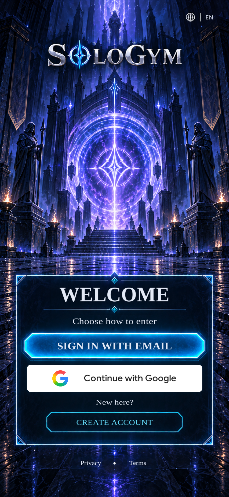
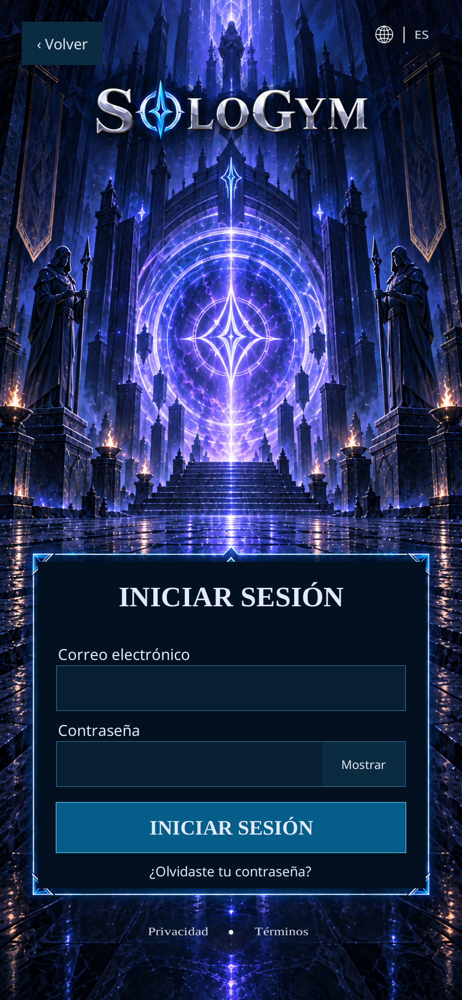

# WIN-002 — native Welcome and sign-in implementation

The user approved the retained Welcome v1 render with “si, esta perfecta”. The native Welcome screen and email form are assembled in Unity using the requested target-render workflow: map the approved image, complete the window, then compare a small number of full-screen captures. Approval of the source target and earlier Home preview does not imply acceptance of this new build or a verified account sign-in.

## Implemented

- Welcome is the first scene. The verified Android update is **0.2.1**, version code **3**, with email and Google configured. Retained visual captures and the Linux player are from **0.2.0**; the UI is unchanged. Local builds with `SOLOGYM_REVIEW` expose the earlier Home as an explicitly labeled sample, even when Firebase is configured. This route does not authenticate a user.
- English/Spanish device detection and persistent manual language choice are shared with Home. Live text and controls use the [runtime pixel map](../../design/mapping/WIN-002-welcome-runtime-map.json) and shared artwork.
- Email/password entry includes required-field and email-format validation, masked password input with a visibility control, submit progress, cancellation/back, and localized error states. Leaving the form clears its password; only language preference is written to PlayerPrefs.
- Google uses the [official provider mark and Google Sans font](../../design/reference-manifests/WIN-002-google-brand-assets.md), replacing the illustrative AI mark while retaining the intended control position. The provider button is an intentional difference from the raster proposal.
- `FirebaseWelcomeAuthService` implements Firebase email sign-in and an Android Credential Manager Google adapter. Missing SDK/configuration returns unavailable; it never creates a simulated successful account.
- A successful Firebase identity requests the age/region onboarding checkpoint, WIN-006. It does not authorize the sample Home, infer consent or create a fitness profile. Completed-profile routing is still future work.

Create-account entry begins the pending onboarding/signup journey. Account creation (WIN-004), password recovery (WIN-005), age/region setup (WIN-006), consent/legal content (WIN-007), guardian flow (WIN-008) and their production data remain unimplemented. Their controls show an unavailable notice rather than fabricate completion. The existing Home continues to use fictional local data and a static illustrated character.

## Authentication and build status

The Firebase project **`sologym-66395`** is created on the **Spark** plan in the user's selected personal account. Android package **`com.kalavhan.sologym`**, its actual Firebase app ID and the installation-signing SHA-1/SHA-256 fingerprints are registered. **Email/Password is enabled.** The ignored local files retain the existing Firebase client fields and add the real OAuth values observed in the Console; no project ID, app ID, API key or OAuth client is guessed.

**Google and Email/Password are enabled.** The user answered **“1”**, selecting the first option authorizing use of the chosen public support contact. This resolved the earlier permission block, and the Google provider was saved successfully. Actual web and Android OAuth clients are configured, and the Android client matches the package and existing APK signing SHA-1. The Console's OAuth audience already shows **External / In production**; this was inspected without changing the audience. No personal email address is recorded in the repository. These configuration steps do not establish a successful sign-in on a phone. See [Firebase authentication setup](../engineering/firebase-auth-setup.md).

The repository retains an installer for the pinned official Firebase Unity SDK and local C#/Java integration source. SDK binaries, downloaded dependencies and environment-specific client configuration are excluded from Git. Run the [SDK installer](../../tools/install_firebase_unity.py) and follow the setup document before building a configured player. A clean clone without the SDK remains compilable and reports authentication unavailable.

The final **0.2.1 / code 3 Android ARM64 IL2CPP review APK built successfully** with both providers configured and the local review flag. It is **35,637,787 bytes** (about 34 MiB), SHA-256 `f56b0451b23c12cedff4948ea0e24b34de9624750731b23da646376774643e23`. Its v2 signature is valid and retains the previous installation signing certificate. The compiled Android web-client resource and the Unity-packaged Firebase configuration both match the actual OAuth web client. Advertising ID, AdServices attribution and install-referrer permissions are absent; Analytics collection is explicitly deactivated. Build evidence is retained in [the delivery manifest](../../artifacts/visual/WIN-002/build-verification.json).

The Linux player and retained UI captures remain **0.2.0** because the interface is unchanged. The five focused checks below passed before the final visual-only button correction. Neither the updated APK's successful packaging nor provider configuration proves a successful sign-in.

No physical-device keyboard check, successful email/Google sign-in, provider cancellation check on a phone, or user acceptance of the new build is claimed. The Google native adapter supports Android only; iOS Google/Apple integration and an iOS binary remain pending.

## Focused verification and retained evidence

The [runtime check result](../../artifacts/visual/WIN-002/welcome-en-final.smoke.json) records five passing checks: language selection, email input and validation, password masking/reveal, password clearing on Back, and an unconfigured provider being unable to authorize Home. These checks use an explicitly unconfigured auth service and do not contact a provider or prove that Firebase is connected.

The retained captures are actual Unity player output at **853 × 1844**, with live text and controls. Whole-window comparison uses the unmodified approved locale reference, without resizing or registration. The metrics are descriptive differences, never an automatic 1:1 approval. Shared artwork differs slightly between the independently generated EN/ES references, and live font rasterization plus the official Google control also produce expected differences.

| View | Native capture | Comparison evidence |
| --- | --- | --- |
| Welcome · English | [Player capture](../../artifacts/visual/WIN-002/welcome-en-final.png) | [Side by side](../../artifacts/visual/WIN-002/comparison-en.side-by-side.png) · [Overlay](../../artifacts/visual/WIN-002/comparison-en.overlay.png) · [Metrics](../../artifacts/visual/WIN-002/comparison-en.metrics.json) |
| Bienvenida · Español | [Captura del reproductor](../../artifacts/visual/WIN-002/welcome-es-final.png) | [Comparación](../../artifacts/visual/WIN-002/comparison-es.side-by-side.png) · [Superposición](../../artifacts/visual/WIN-002/comparison-es.overlay.png) · [Métricas](../../artifacts/visual/WIN-002/comparison-es.metrics.json) |
| Email form · Español | [Native form](../../artifacts/visual/WIN-002/email-es-final.png) | Additional form layout for review; no previously approved email-form raster |

The final full-screen captures were reviewed after correcting the Google button corners; no text overflow was found. The [v1 target manifest](../../design/reference-manifests/WIN-002-welcome-sign-in-v1.json) preserves the source hashes; implementation captures do not replace it. The [clean-plate prompt](../../design/prompts/WIN-002-welcome-clean-plate-v1.txt), [controller](../../app/Assets/SoloGym/Scripts/WelcomeState.cs), [screen assembly](../../app/Assets/SoloGym/Scripts/WelcomeScreen.cs) and [Firebase adapter](../../app/Assets/SoloGym/Scripts/FirebaseWelcomeAuthService.cs) remain available for subsequent work.

