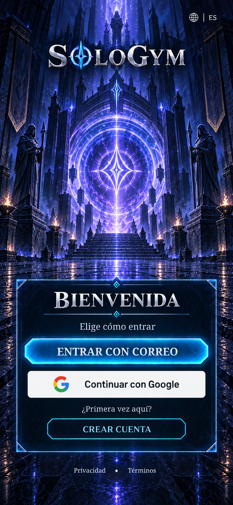
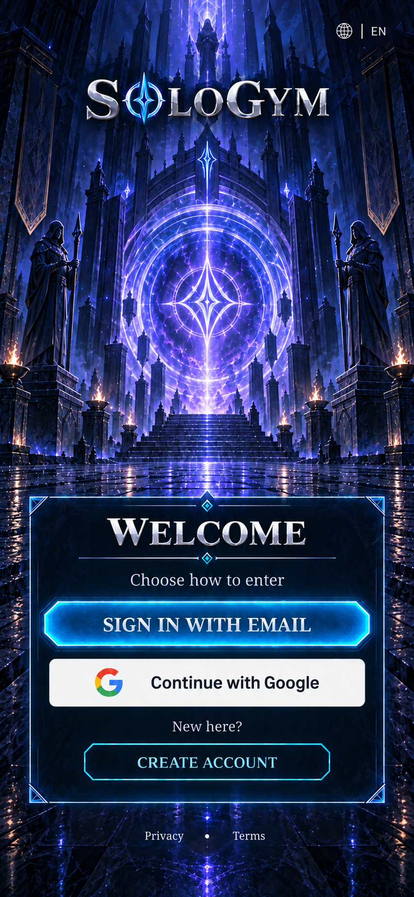

# WIN-002 — Bienvenida / Iniciar sesión

**Estado: propuesta visual v1 para revisión.** Inicio (WIN-001) ya fue aceptado por el usuario después de instalarlo en Android: «se ve exactamente como lo esperaba». El siguiente hito es la entrada a SoloGym. Esta propuesta conserva el templo índigo, el portal violeta, los marcos angulares cian y la tipografía plateada del juego.

Esta entrega define la ventana y conserva su referencia visual; todavía no conecta cuentas ni modifica la aplicación instalada. Los [datos y textos EN/ES](../../data/windows/WIN-002-welcome-sign-in.json) y el [manifiesto de imágenes](../../design/reference-manifests/WIN-002-welcome-sign-in-v1.json) permiten continuar sin reinterpretar el diseño.

## Referencias conservadas

Los renders muestran la **bienvenida en Android, sin sesión y con conexión**. Son propuestas completas de composición, no capturas de una autenticación funcionando. Los archivos originales, dimensiones, prompts y hashes se guardan en el manifiesto; una corrección posterior recibe otra versión.

### Español

### English

El botón de Google del render es una representación de ubicación. La implementación utilizará el recurso o componente oficial, con su logotipo y tipografía, y se comparará antes de dar por cerrado el hito. La imagen generada no se convierte en un activo de marca de producción.

## Pasos de la ventana

1. **Bienvenida:** detectar el idioma, permitir cambiarlo y elegir «Entrar con correo», «Continuar con Google» o «Crear cuenta». Los enlaces de privacidad y términos se pueden abrir sin sesión.
2. **Acceso por correo:** reemplazar las opciones dentro del mismo marco por correo, contraseña, control de visibilidad, «Iniciar sesión», recuperación y regreso. El teclado desplaza el contenido útil; los campos no quedan ocultos. La composición de este segundo paso se revisará antes de cerrar la implementación.
3. **Acceso con Google:** abrir la interfaz del proveedor. Cancelar regresa a Bienvenida conservando una ruta clara para intentarlo de nuevo.
4. **Resolver el acceso:** una cuenta existente vuelve al punto de configuración autorizado o a Inicio. Una identidad nueva continúa por edad/región (WIN-006), consentimientos (WIN-007) y tutor cuando corresponda (WIN-008), antes de activar el perfil de entrenamiento. Crear cuenta con correo termina en WIN-004; recuperar contraseña pertenece a WIN-005.

El acceso no solicita peso, altura, objetivos, equipo físico ni apariencia. Esas decisiones tienen sus propias ventanas. La identidad de Google no sustituye el consentimiento para datos de entrenamiento ni convierte el perfil en público.

## Composición y acciones

| Zona | Contenido | Acción |
| --- | --- | --- |
| Cabecera | SoloGym y selector EN/ES | Abrir idioma y volver a esta vista sin perder contexto |
| Escenario | Portal dentro del mismo mundo que Inicio | Decoración; sin personaje antes de personalizarlo |
| Marco principal | Bienvenida y elección de acceso | Correo o proveedor |
| Registro | «¿Primera vez aquí?» / «Crear cuenta» | Iniciar el recorrido de cuenta nueva |
| Pie | Privacidad y términos | Documento de solo lectura; no registra aceptación |

La referencia solicitada usa la proporción de Inicio, 853 × 1844; el manifiesto guarda las dimensiones realmente recibidas. El [mapa inicial](../../design/mapping/WIN-002-welcome-map-v1.json) conserva rectángulos, esquinas y centros de los controles; se afinará después de aceptar el render. Se mantendrá la proporción dentro del área segura y se usarán superficies táctiles de al menos 48 × 48 unidades lógicas. Un teléfono más corto puede desplazar el panel o reducir el escenario, nunca recortar los controles o deformar el arte.

En iOS se propone una fila adicional de **Continuar con Apple**, del mismo tamaño que Google, conservando el mismo escenario y marco. Esta variante requiere su propia composición antes de implementar iOS. La regla 4.8 pide una alternativa equivalente con las protecciones que describe; Sign in with Apple es la propuesta para cumplir ese requisito en SoloGym. [Apple: servicios de inicio de sesión](https://developer.apple.com/app-store/review/guidelines/#login-services)

## Estados y datos

| Estado | Comportamiento |
| --- | --- |
| Esperando elección | Botones e idioma disponibles |
| Solicitud en curso | Una solicitud activa; indicar progreso y evitar envíos duplicados |
| Cancelación del proveedor | Volver sin tratarla como un error |
| Sin conexión | Explicar que el acceso requiere internet y permitir reintentar |
| Credenciales incorrectas | Mensaje neutral sin confirmar si el correo tiene cuenta |
| Error del proveedor | Volver a la elección con una acción de reintento |
| Sesión expirada | Solicitar acceso de nuevo; conservar los datos de juego |
| Demasiados intentos | Respetar el intervalo indicado por el servidor |

El contrato distingue vista, idioma, plataforma, estado de conexión, solicitud activa y resultado de autenticación. No hay credenciales reales en fixtures. Cambiar el idioma conserva la vista; la contraseña solo permanece durante el formulario y su envío, nunca se guarda en PlayerPrefs, registros o analítica.

Para Google se conservarán colores, proporción y prominencia de su botón oficial; no se convertirá el logotipo en una runa. La interfaz nativa del proveedor se mantiene fuera de la ilustración del juego. [Marca de Google](https://developers.google.com/identity/branding-guidelines), [Credential Manager en Android](https://developer.android.com/identity/sign-in/credential-manager-siwg)

El servidor deberá validar el token y usar el identificador estable del proveedor, sin vincular cuentas por coincidencia de correo. Las sesiones se guardarán mediante almacenamiento protegido de plataforma. Un flujo OAuth para una aplicación nativa utilizará el navegador o sesión del sistema y las comprobaciones correspondientes; no una WebView que recoja credenciales de Google. [Validación de Google](https://developers.google.com/identity/sign-in/android/backend-auth), [OAuth para aplicaciones nativas](https://datatracker.ietf.org/doc/html/rfc8252)

## Trabajo de este hito

1. Aceptar la propuesta visual principal y sus textos.
2. Reutilizar la dirección artística de Inicio; preparar un fondo compartido, marco y controles editables. Esta ventana no necesita sprites de personajes ni una tanda de equipo.
3. Completar las vistas de correo, errores y teclado dentro de la misma ventana. Resolver el servicio de cuentas y las credenciales de desarrollo antes de presentar autenticación real.
4. Construir la ventana completa y comparar capturas EN/ES con las referencias guardadas. Hacer solo comprobaciones enfocadas de idioma, cancelación, error, teclado y retorno al punto correcto; sin renders por botón.

Siguen pendientes el proveedor de autenticación y su proyecto, los identificadores OAuth, el registro de la firma Android y la configuración Apple. Aprobar la imagen no crea esos servicios ni certifica políticas de acceso por país. La ventana solo se considerará funcional cuando el acceso real y las rutas necesarias estén resueltos; un acceso ficticio no contará como Google funcionando.

**Decisión visual actual:** portal, distribución del panel, jerarquía de botones y textos de Bienvenida en español/inglés. La implementación mantiene el método solicitado: referencia aprobada, construcción completa y revisión visual enfocada.
