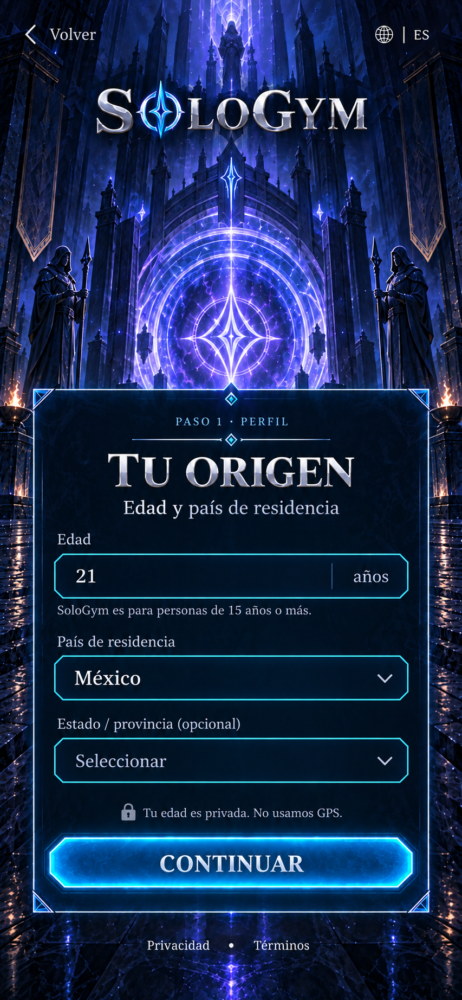
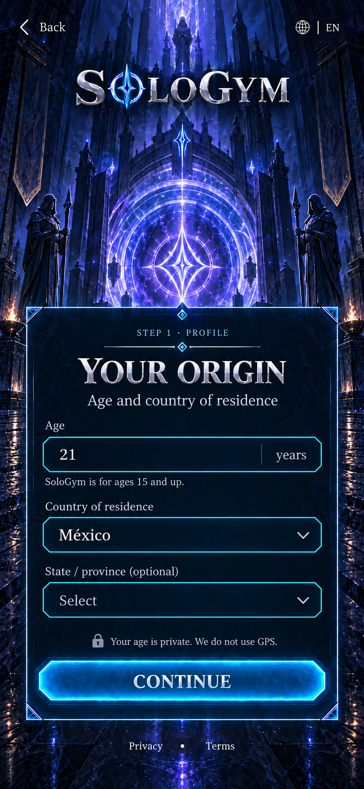
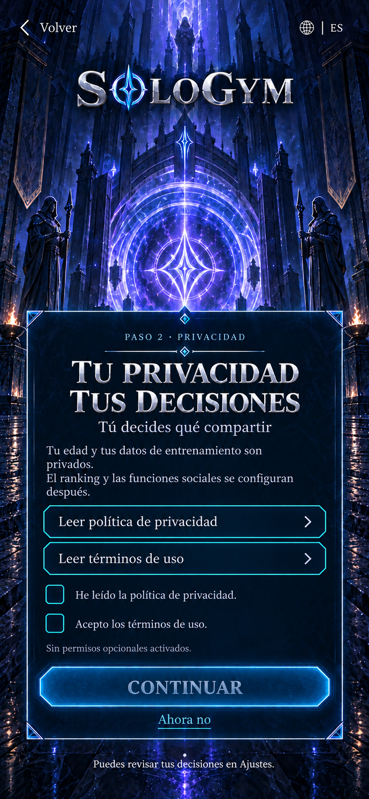
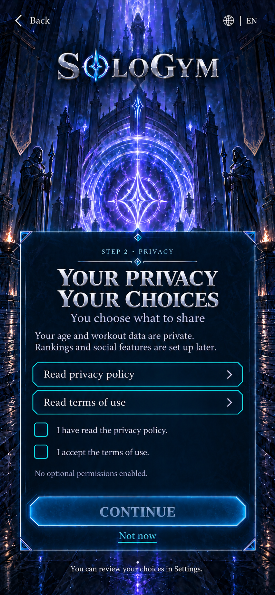

# WIN-006 + WIN-007 — Origen, privacidad y consentimiento

Estado: **propuesta visual v1 aprobada para implementación**. Fecha: 2026-09-25.

Aprobación expresa: “aprobado, no hay necesidad de generar el apk aun. implementa y terminanndo prepare la siguiente ventana”. Se implementan ambas ventanas completas y se verifican sin generar un APK. Al terminar se prepara la siguiente propuesta; esta aprobación no autoriza implementar automáticamente una ventana nueva. Seguimiento: [informe de implementación](WIN-006-007-implementation.md).

El usuario aceptó la versión entregada de acceso: “perfect, is working great, next window”. Después amplió esta iteración: “haz privacidad y consentimiento tambien en esta iteracion”. La aceptación reportada no identifica proveedor ni dispositivo y no sustituye pruebas independientes de ambos proveedores.

## Referencias conservadas

Generadas con la herramienta integrada `image_gen`, usando la Bienvenida aprobada como referencia. Cada archivo es inmutable y tiene dimensiones y SHA-256 en su manifiesto. Los prompts exactos están en `design/prompts/`. Estas imágenes son los objetivos visuales aprobados, no capturas de la implementación.

### WIN-006 — Tu origen

### WIN-007 — Tu privacidad, tus decisiones

## Flujo de esta iteración

1. Acceso verificado → **WIN-006**: edad declarada, país de residencia y estado/provincia opcional. Los campos reales comienzan vacíos; 21/México son datos ficticios del render. Sin GPS ni inferencia del país a partir del idioma.
2. Validación de edad y política de país → **WIN-007**. Edad mínima del producto: 15. Esto no determina por sí solo los requisitos de consentimiento de cada país. Política desconocida o país no habilitado muestra una salida clara, sin dar acceso por defecto.
3. Leer documentos completos en un lector reutilizable, marcar las decisiones aplicables y continuar. Dos casillas inicialmente vacías: reconocimiento de lectura de privacidad y aceptación de términos. No se confunden con consentimiento para datos de salud. No se añaden permisos opcionales, marketing o participación en rankings.
4. Si corresponde una autorización de tutor, se dirige a WIN-008; de lo contrario al próximo paso de perfil. WIN-008/009 no se implementan en esta iteración: el límite se muestra explícitamente, sin simular un perfil terminado. La entrada previa al registro por correo conserva un borrador hasta WIN-004.

**Volver** conserva el borrador entre estos dos pasos. **Ahora no** sale del onboarding, descarta decisiones no guardadas y vuelve al acceso; no elimina la cuenta Firebase. Cambiar de idioma conserva campos y decisiones. Cambiar país limpia la subdivisión anterior.

## Datos y documentos

Los contratos propuestos están en [WIN-006](../../data/windows/WIN-006-age-region.json) y [WIN-007](../../data/windows/WIN-007-privacy-consent.json). Firebase Authentication ya identifica al usuario; no guarda automáticamente este perfil. Firestore sigue sin integrarse para este flujo.

La implementación propuesta guarda elegibilidad de forma privada y registra decisiones con versiones de documentos, idioma y hora del servidor. El servidor debe validar la política, los campos y las versiones; el cliente no puede marcarse a sí mismo como adulto, autorizado o con onboarding completo. La edad es autodeclarada, no una verificación de identidad. Para funciones de adulto debe reconfirmarse cuando proceda; no se inventa una fecha de cumpleaños para incrementar la edad automáticamente.

Las decisiones sociales/ranking se toman después y no publican edad, peso ni información de entrenamiento. Los menores mantienen la configuración privada acordada. Cualquier consentimiento específico necesario para datos de salud se presenta antes de recoger esos datos y separado de los términos.

La pantalla propone el diseño, **no un texto legal final**. Antes de habilitar aceptación real deben existir documentos completos EN/ES, versiones aprobadas, identificación y contacto del responsable, y reglas reales de conservación/eliminación y países. Si faltan documentos, el lector muestra el estado no disponible y Continuar permanece bloqueado; ningún enlace ficticio o documento de muestra se registra como aceptado. Ajustes permitirá revisar decisiones cuando ese hito se implemente; el pie del render representa ese comportamiento objetivo.

## Plan de construcción aprobado

| Hito | Construcción completa | Verificación enfocada |
| --- | --- | --- |
| WIN-006 | Reutilizar fondo y marco; textos vivos EN/ES, entrada numérica, catálogos país/subdivisión, validación y navegación | Captura por idioma frente al render; límites de edad, país sin política, subdivisión y cambio de idioma |
| WIN-007 | Marco compartido, lector de documentos, casillas, salida, estados de guardado y recibo privado cuando el servicio esté disponible | Captura por idioma; controles desmarcados, documentos ausentes, rechazo/salida, reintento sin recibos duplicados |

Se construyen ventanas completas con componentes compartidos y después se compara visualmente. No se genera una imagen para cada botón. No se necesitan personajes, equipo ni sprites nuevos en este flujo. Los selectores y el lector son estados reutilizables del mismo marco, no nuevos fondos generados.

Los mapas iniciales de esquinas y centros están en `design/mapping/WIN-006-proposal-map-v1.json` y `WIN-007-proposal-map-v1.json`. Son estimaciones manuales sobre el render ES: se medirán al construir. El texto inglés de privacidad ocupa menos líneas y desplaza sus filas; su referencia se compara por separado. El render inglés de origen conserva el endónimo “México”; la etiqueta localizada de producción será “Mexico”. Fuera de esa corrección de texto explícita, los renders aceptados serán la referencia de posición, color y composición. No se afirma igualdad de píxeles antes de disponer de capturas nativas.

## Validación de esta entrega

Se inspeccionaron las cuatro imágenes completas, se conservaron prompts y hashes y se validó el JSON de esta entrega. No cambió código Unity, configuración Firebase ni APK; no se repitieron builds o pruebas de componentes ajenos a la propuesta.

**Decisión registrada:** las dos ventanas EN/ES están aprobadas para su implementación. El APK queda expresamente fuera de esta iteración. La verificación nativa y sus diferencias se registran en el informe de implementación; no se sustituyen estos renders por capturas.
