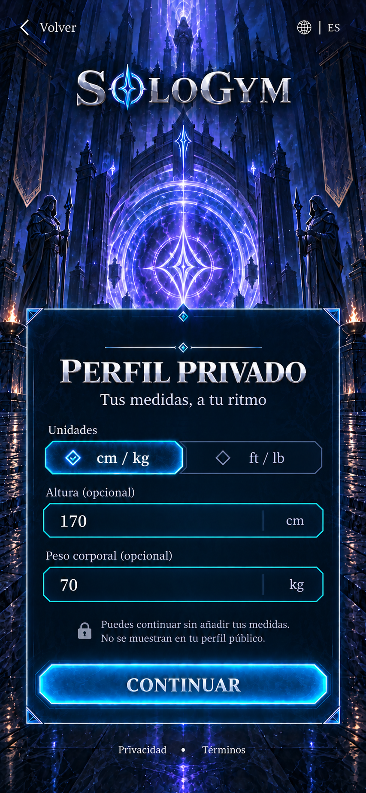
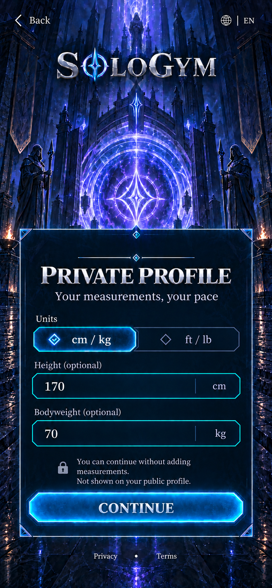

# WIN-009 — Perfil físico privado

Estado: **propuesta visual v1 EN/ES pendiente de aprobación**. Fecha: 2026-09-25.

Este hito sigue a WIN-007 para una persona autenticada que puede continuar. WIN-008 sigue siendo la rama condicional de tutor; no se elimina. La creación de una cuenta por correo continúa en WIN-004 cuando corresponda. La propuesta se prepara por la instrucción de avanzar a la siguiente ventana después de implementar WIN-006/007; no autoriza implementar WIN-009 todavía.

## Referencias retenidas

Generadas con la herramienta integrada **ImageGen** después de implementar WIN-006/007. La versión ES parte del render aprobado de origen; la versión EN localiza esa composición. Son objetivos propuestos, no capturas de UI implementada. Ambas imágenes miden **853 × 1844**. Los archivos, dimensiones, prompts exactos y hashes SHA-256 están en el [manifiesto v1](../../design/reference-manifests/WIN-009-private-fitness-profile-v1.json).

Se inspeccionaron las dos ventanas completas: texto legible, sin solapamientos visibles, campos opcionales y valores ficticios. El aviso inglés ocupa tres líneas; el español dos. La implementación futura debe respetar la referencia de cada idioma, no sustituirla por un render nuevo sin aceptación.

## Propósito

Recoger solo los datos privados útiles para adaptar entrenamientos. Altura y peso son opcionales y no clasifican a la persona como obesa, musculosa o de un somatotipo; tampoco cambian automáticamente su apariencia. El avatar y su cuerpo personalizable se resuelven después en sus ventanas propias. No se muestran IMC, calorías, dietas, metas de peso ni rankings.

## Pasos de la ventana

1. **Antes de tus datos.** Explicar qué datos se proponen recoger, su finalidad, su privacidad y cómo omitir las medidas. Si la política aplicable exige consentimiento específico para datos de salud, presentarlo por separado, con documento disponible y decisión desmarcada, antes de habilitar la recogida. WIN-007 no sustituye ese consentimiento.
2. **Tus medidas, a tu ritmo.** Selector métrico/imperial; altura y peso corporal opcionales, vacíos de inicio. Continuar permite omitir ambos. Cambiar unidades conserva el valor mediante conversión; limpiar un campo lo mantiene ausente, no como cero. La propuesta visual principal muestra este paso con una persona adulta ficticia; no usa datos del usuario.
3. **Cómo llegas al entrenamiento.** Pregunta breve de estado actual con opciones de preparación y una salida de pausa. Dolor, lesión, enfermedad o incertidumbre conducen a un estado de pausa/orientación, sin diagnóstico automático. La experiencia detallada y los objetivos se configuran en WIN-010; el equipo en WIN-011 y el horario en WIN-012. El camino adolescente mantiene privacidad y preguntas de supervisión aplicables al contenido revisado, sin deducirlas de la apariencia.

Los pasos reutilizan el mismo fondo y marco. No requieren una imagen por campo, botón ni estado. Volver y cambiar idioma conservan el borrador; salir antes de guardar descarta lo no guardado. No se envían medidas al ranking, a chat ni al perfil público.

## Datos propuestos

| Campo | Contrato |
| --- | --- |
| `unitSystem` | `metric` o `imperial`; preferencia de presentación. |
| `heightCm` | Número opcional, normalizado a centímetros al guardar; nunca inferido. |
| `bodyweightKg` | Número opcional, normalizado a kilogramos; nunca equivale a un diagnóstico. |
| `readiness` | Declaración actual, compatible con los valores existentes `ready`, `low_energy`, `ill`, `pain`, `injury`; la incertidumbre conserva una salida de pausa y no fuerza una respuesta. |
| `healthDataDecision` | Solo la decisión exigida por una política revisada y su versión; no una bandera local que sustituya el recibo del servidor. |

La edad procede de WIN-006, no se vuelve a solicitar. El esquema del generador actual no requiere altura ni peso: mantenerlos opcionales no impide generar planes basados en experiencia, objetivo, equipo y disponibilidad. Las medidas pertenecen a un documento privado del perfil; una futura adaptación del esquema debe ser explícita y conservar los campos desconocidos como ausentes. Las edades, países y documentos todavía requieren su configuración de producción.

## Composición propuesta

Pantalla vertical de 853 × 1844, mismo portal índigo/violeta, logotipo SoloGym, marcos de vidrio cian y serif plateada. Un panel amplio con dos campos legibles y selector de unidades, sin personaje ni equipo nuevo. Texto visible y controles se construirán como UI editable al implementar. Esta ventana aprovecha el arte aceptado y no abre todavía la producción de sprites.

Copia principal ES: **PERFIL PRIVADO**, “Tus medidas, a tu ritmo”, “Altura (opcional)”, “Peso corporal (opcional)”, “Puedes continuar sin añadir tus medidas.”, “No se muestran en tu perfil público.”, **CONTINUAR**. Fixture ficticio: 170 cm y 70 kg; idioma español, unidades métricas. El inicio real estará vacío.

Copia principal EN: **PRIVATE PROFILE**, “Your measurements, your pace”, “Height (optional)”, “Bodyweight (optional)”, “You can continue without adding measurements.”, “Not shown on your public profile.”, **CONTINUE**. Mismo fixture ficticio y mismas posiciones; no se añade contenido que prometa seguridad absoluta ni que afirme un backend inexistente.

La frase de privacidad describe la visibilidad del perfil en la app; los documentos completos deben explicar el tratamiento por el servicio y el acceso operativo necesario. No implica cifrado de extremo a extremo ni excluye el procesamiento por el servicio.

## Cierre esperado de G0

Los dos objetivos completos ES/EN están guardados con sus prompts, dimensiones y hashes. **Decisión pendiente: aceptar o ajustar esta ventana y su flujo de tres pasos.** Solo la aceptación de estos objetivos autorizará construir WIN-009; las etapas siguientes de objetivos, equipo, agenda y avatar no se incluyen automáticamente. No cambió código ni se recopiló información de salud al preparar esta propuesta.
