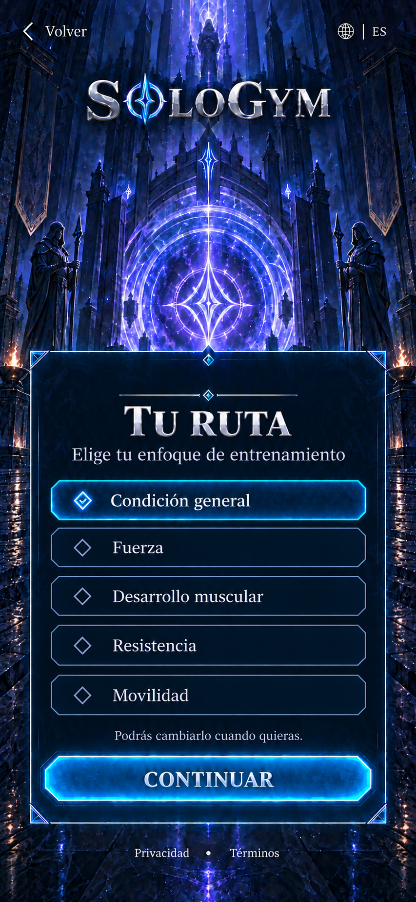
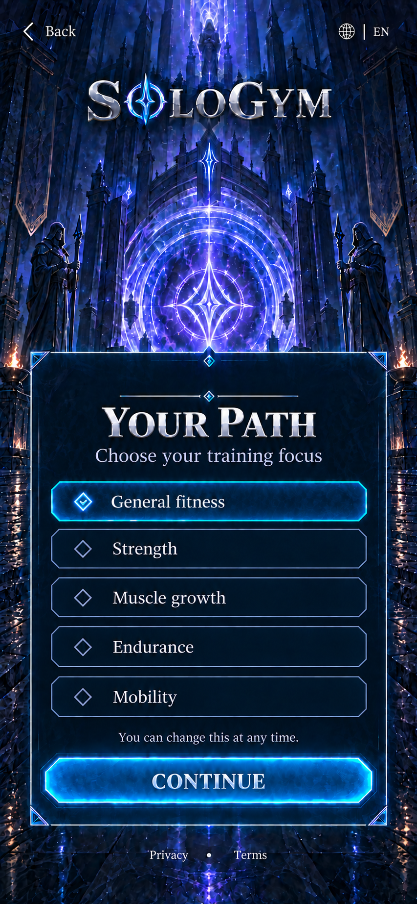

# WIN-010 — Objetivos y experiencia

Estado: **propuesta visual v1 EN/ES pendiente de aprobación**. Fecha: 2026-09-25. No autoriza implementar WIN-010 ni generar APK.

Esta ventana sigue al perfil privado para la ruta de acceso habilitada. Se apoya en los identificadores y límites del [esquema de perfil](../../data/schemas/training-profile.schema.json), las [reglas existentes](../../data/training/rules.json) y la [especificación del generador](../training/generation-spec.md). No introduce una nueva clasificación médica ni nuevas prescripciones de ejercicio.

## Flujo en tres pasos

1. **Tu ruta.** Elegir un enfoque. Para adultos: condición general, fuerza, desarrollo muscular, resistencia o movilidad. La elección empieza vacía; el render usa una selección ficticia de condición general. No hay objetivos de peso, calorías, estética ni recompensas por escoger una ruta más exigente.
2. **Tu punto de partida.** Describir la experiencia con dos opciones: “Estoy empezando o retomando” y “Entreno con regularidad y conozco los movimientos básicos”. Se corresponden con `beginner` e `intermediate`. “No estoy seguro” propone comenzar con la base y pide confirmar esa opción; no concede un nivel de forma automática. La apariencia del avatar no responde esta pregunta. Una rutina previa no certifica técnica ni determina por sí sola la dificultad.
3. **Revisar y continuar.** Mostrar enfoque y experiencia elegidos con enlaces para cambiarlos; explicar que todavía se necesitan equipo y disponibilidad antes de preparar las sesiones. Continuar lleva a WIN-011. Volver o cambiar idioma conserva el borrador, y salir descarta lo no guardado. Cambiar de objetivo más adelante no borra progreso.

Los tres pasos reutilizan el portal y el marco. Se conservan renders completos ES/EN del primer paso, sin generar una imagen por opción o por estado.

## Datos y reglas existentes

| Entrada | Valores o tratamiento |
| --- | --- |
| `goal` | `general_fitness`, `strength`, `muscle_growth`, `endurance`, `mobility`. |
| `experience` | `beginner` o `intermediate`; elección explícita, no inferida de medidas o avatar. |
| Edad/grupo | Procede del flujo privado de acceso, sin volver a solicitar fecha de nacimiento. |
| Preparación | Procede de WIN-009 y se vuelve a consultar al entrenar; esta ventana no transforma una pausa en disponibilidad. |
| Estado del borrador | Local y no guardado hasta que exista el servicio privado correspondiente. No se inventa recibo remoto. |

Para adolescentes, el primer alcance presenta **condición general** y **movilidad**, evitando ofrecer una especialización que las reglas actuales después sustituirían. El generador existente aplica una base general cuando recibe fuerza, desarrollo muscular o resistencia para menores de 18; una selección específica de movilidad conserva esa finalidad. Estos son límites del borrador de producto, no una afirmación de que otras actividades sean inadecuadas por edad.

La ruta adolescente conserva las condiciones de supervisión de fuerza del catálogo y las políticas de acceso aplicables. Elegir experiencia intermedia no habilita Hard para adolescentes. En adultos tampoco lo habilita automáticamente: las reglas existentes consideran experiencia, preparación y el resto del perfil. No se ofrecen metas de pérdida de peso a adolescentes ni se conecta esta selección con ayuno.

La [investigación ya registrada](../research/2026-09-25-fitness-game-research.md) fundamenta usar contenido estructurado, experiencia, objetivos, equipo, tiempo y preparación como entradas. Las dosis y clasificaciones concretas del catálogo siguen siendo contenido de producto pendiente de revisión profesional y juvenil; esta UI no resuelve esa revisión. No se cambia el algoritmo ni se prescribe una sesión desde esta propuesta.

## Dirección visual y texto

Mismo portal índigo/violeta, logotipo SoloGym, serif plateada y vidrio cian angular. Panel amplio con cinco opciones verticales de selección única; la primera seleccionada en el fixture adulto. Se conserva el arte aceptado de WIN-009 y su distribución principal. Sin personaje, equipamiento nuevo, gráficos corporales, barras de XP ni tarjetas blancas.

| Español | English |
| --- | --- |
| TU RUTA | YOUR PATH |
| Elige tu enfoque de entrenamiento | Choose your training focus |
| Condición general | General fitness |
| Fuerza | Strength |
| Desarrollo muscular | Muscle growth |
| Resistencia | Endurance |
| Movilidad | Mobility |
| Podrás cambiarlo cuando quieras. | You can change this at any time. |
| CONTINUAR | CONTINUE |

El detalle y la confirmación se presentan en los pasos siguientes mediante texto vivo. La primera selección no prepara todavía un plan: WIN-011 y WIN-012 completan equipo y tiempo, y los requisitos de acceso, datos privados y contenido permanecen activos.

## Referencias retenidas

Generadas con la herramienta integrada **ImageGen** tras construir WIN-009 y obtener sus primeras comprobaciones nativas. La composición ES parte del objetivo aprobado de WIN-009; EN localiza el nuevo render ES. Ambas miden **853 × 1844**. El [manifiesto v1](../../design/reference-manifests/WIN-010-goals-experience-v1.json) conserva archivos, dimensiones, hashes y fixture. Los [prompts ES](../../design/prompts/WIN-010-goals-experience-es-v1.txt) y [EN](../../design/prompts/WIN-010-goals-experience-en-v1.txt) guardan exactamente lo enviado a la herramienta.

Se inspeccionaron ambas ventanas completas: cinco opciones legibles, solo la primera seleccionada en el fixture, copia ES/EN correcta, portal y marcos conservados, sin solapamientos ni recortes visibles. Son renders propuestos, no capturas de una UI implementada. Sus dimensiones y hashes se preservarán como referencia si el usuario los acepta.

**Decisión pendiente: aprobar o ajustar ambos objetivos visuales y el flujo de tres pasos.** WIN-010 se limita a propuesta de flujo, datos y diseño hasta esa aprobación. El equipo, la agenda y el avatar siguen fuera de esta ventana.
