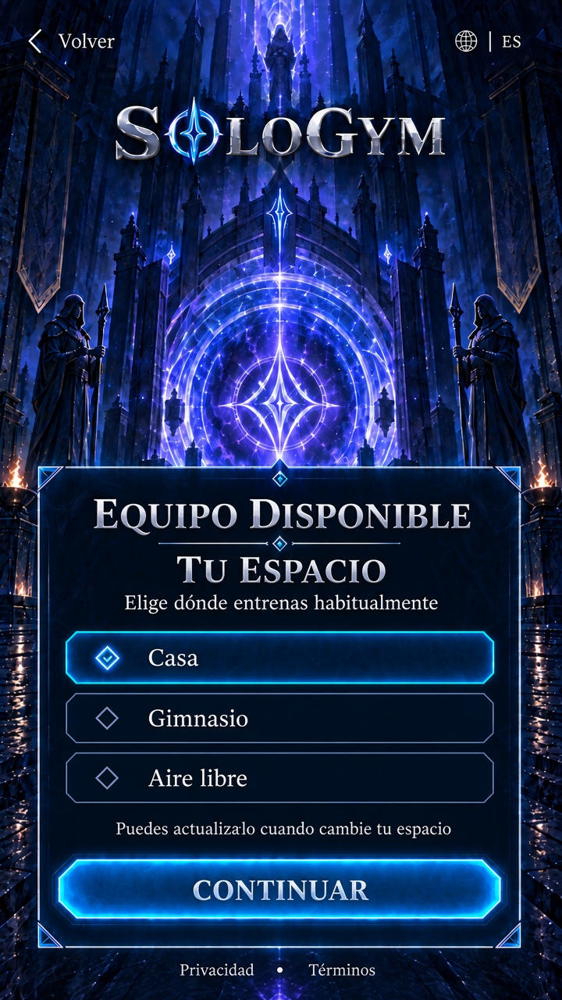
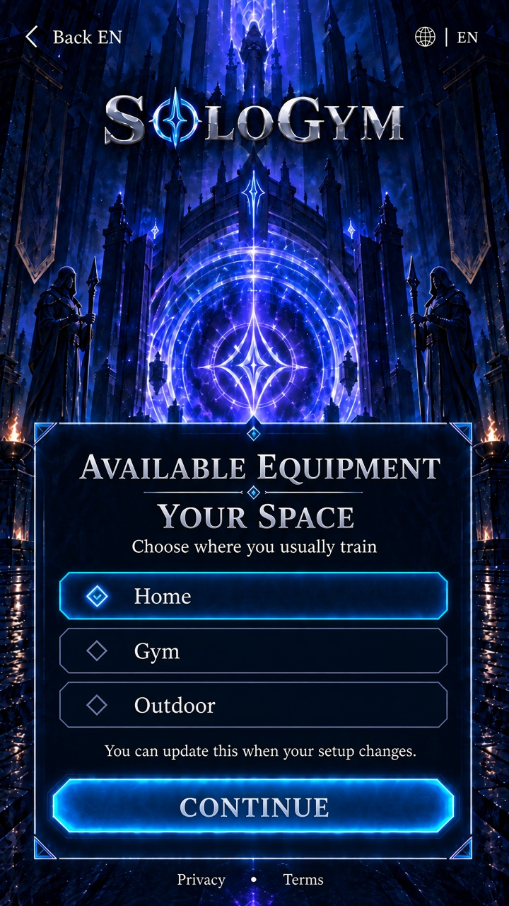

# WIN-011 — Equipo disponible

Estado: **G0 propuesto; interfaz nativa implementada en reproductor Linux; aceptación del usuario pendiente**. Fecha: 2026-09-26. El ledger G0 sigue en `awaiting_user_approval` hasta tu revisión de flujo, copia y renders.

Esta ventana sigue a objetivos y experiencia en la ruta de configuración. Usa `environment` y `equipment[]` del [esquema de perfil](../../data/schemas/training-profile.schema.json), el [catálogo de equipo](../../data/training/equipment.json) y la derivación por ejercicios en [exercises.json](../../data/training/exercises.json). No añade rangos de carga ni perfiles guardados con nombre.

## Flujo en tres pasos

1. **Tu espacio.** Elegir `home`, `gym` u `outdoor`. La elección empieza vacía; el render de propuesta puede mostrar **Casa** seleccionada como fixture ficticio.
2. **Lo que tienes.** Lista desplazable de selección múltiple según el entorno (ids que aparecen en al menos un ejercicio compatible). Control destacado **Solo peso corporal** (`equipment: []`). En **aire libre** la lista derivada está vacía: el usuario debe confirmar solo peso corporal. Para continuar hace falta solo peso corporal o al menos un ítem cuando el entorno tiene ítems en catálogo.
3. **Revisar y continuar.** Resumen de lugar y equipo (o solo peso corporal); enlaces para cambiar; aviso de que falta el horario (WIN-012). Continuar lleva a WIN-012 en revisión. Volver e idioma conservan el borrador; salir descarta.

Los pasos 2 y 3 reutilizan el portal y el marco con texto vivo, sin renders retenidos adicionales. El paso 1 conserva objetivos EN/ES completos 853×1844.

## Datos y reglas

| Entrada | Tratamiento |
| --- | --- |
| `environment` | `home`, `gym`, `outdoor` únicamente. |
| `equipment` | Array de ids del catálogo; vacío con `bodyweight_only` explícito. |
| Derivación | Por entorno, ids con al menos un ejercicio que liste el id en `equipment_all` y el entorno en `environments`. |
| Aire libre | Sin filas de catálogo; solo peso corporal explícito. |
| Cargas / perfiles | Fuera de alcance; las cargas se registran manualmente en sesión según la especificación del generador. |

## Dirección visual y texto — paso 1

Mismo portal, logotipo y panel que WIN-009/010. Tres filas de selección única; la primera seleccionada en el fixture de casa.

| Español | English |
| --- | --- |
| TU ESPACIO | YOUR SPACE |
| Elige dónde entrenas habitualmente | Choose where you usually train |
| Casa | Home |
| Gimnasio | Gym |
| Aire libre | Outdoor |
| Puedes actualizarlo cuando cambie tu espacio. | You can update this when your setup changes. |
| CONTINUAR | CONTINUE |

### Paso 2 — Equipo (texto vivo)

| Español | English |
| --- | --- |
| LO QUE TIENES | WHAT YOU HAVE |
| Selecciona todo lo que puedas usar con seguridad hoy | Select everything you can use safely today |
| Solo peso corporal | Bodyweight only |
| Las sesiones al aire libre en este catálogo usan movimientos en espacio abierto y peso corporal. Confirma solo peso corporal para continuar. | Outdoor sessions in this catalog use open-space and bodyweight movements. Confirm bodyweight only to continue. |

### Paso 3 — Revisar (texto vivo)

| Español | English |
| --- | --- |
| REVISAR Y CONTINUAR | REVIEW AND CONTINUE |
| Dónde entrenas | Where you train |
| Equipo | Equipment |
| Solo peso corporal | Bodyweight only |
| Cambiar lugar | Change location |
| Cambiar equipo | Change equipment |
| Todavía configurarás tu horario antes de preparar las sesiones. En esta vista previa no se guarda nada en tu cuenta. | You'll still set your schedule before sessions are prepared. Nothing is saved to your account in this preview. |

## Referencias retenidas

Manifiesto [WIN-011-available-equipment-v1.json](../../design/reference-manifests/WIN-011-available-equipment-v1.json). Prompts [ES](../../design/prompts/WIN-011-available-equipment-es-v1.txt) y [EN](../../design/prompts/WIN-011-available-equipment-en-v1.txt).

**Decisión pendiente: aprobar o ajustar objetivos visuales EN/ES y el flujo de tres pasos.** G1 reutiliza `Art/PortalBackground-v1` y geometría `PortalPage(718, 965)`; N/A arte de personaje nuevo.
